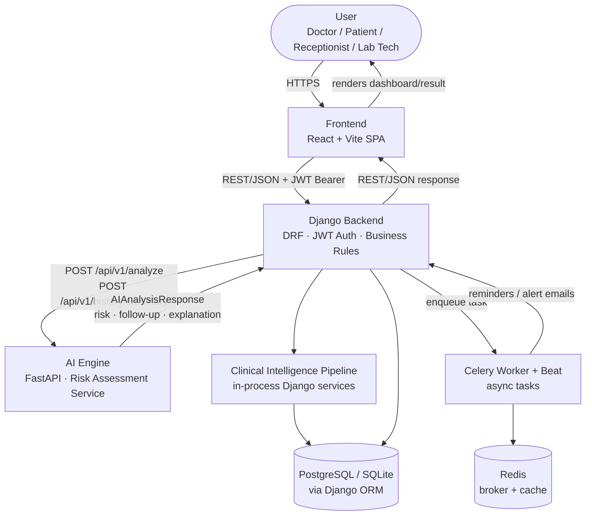
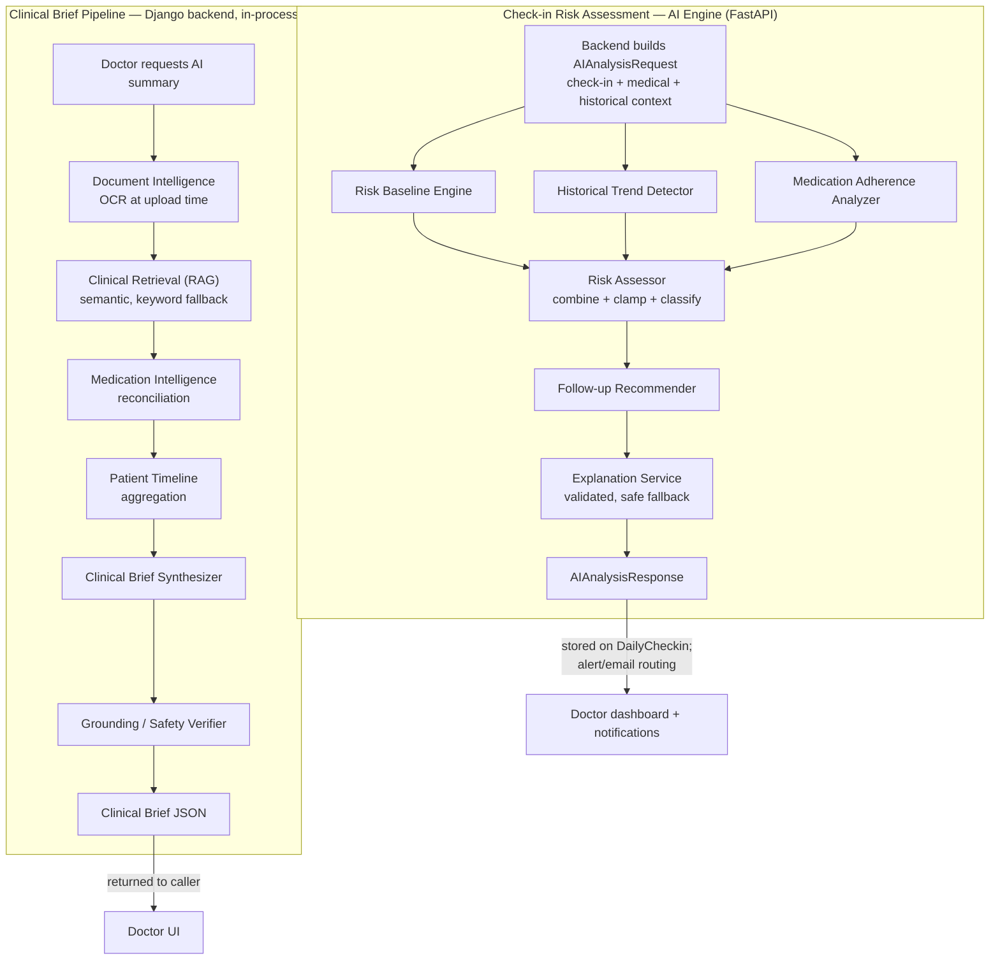

# HealBytes — System Architecture

This document is the full, verified architecture reference for HealBytes. Every claim below was checked directly against the live codebase (not assumed or templated) — request/response contracts, model fields, routing tables, docker-compose services, and test counts are all cited from the actual files that define them. Where a capability doesn't exist yet, it's labeled **Planned** or **TBD** rather than described as if it were live.

For a fast, judge-friendly overview, see the **Architecture** section in [`README.md`](./README.md). This file is the deep dive behind it.

---

## 1. Overall System Architecture

HealBytes is organized as a two-service system built around a modular Django backend, with a single-page React frontend as the presentation layer and a purpose-built FastAPI microservice handling deterministic clinical risk scoring. The Django backend is the system's core: it owns authentication and role-based access control, all persistent data (patients, medications, check-ins, appointments, lab tests, documents, alerts), asynchronous processing via Celery, and a set of in-process clinical-intelligence services that assemble evidence-grounded summaries for doctors. The AI Engine is deliberately kept separate and stateless — it has no database access and no knowledge of HealBytes' domain models beyond the JSON contract it is handed; every fact it reasons over is supplied in the request body by the backend. This separation means the AI Engine can be developed, tested, and eventually replaced (e.g., with a trained model) without touching the Django backend, the database, or the frontend, and vice versa.

Two distinct AI subsystems exist today, and the architecture keeps them intentionally separate rather than blurring them into one "AI layer":

The **Risk Assessment Service** (the AI Engine, FastAPI) analyzes a single patient check-in and returns a deterministic risk verdict, follow-up action, and explanation. It is called synchronously by the Django backend on check-in submission.

The **Clinical Intelligence Pipeline** (Document Intelligence, Retrieval, Medication Intelligence, Timeline, Clinical Brief, Grounding) runs entirely inside the Django backend as a chain of plain Python function calls over the ORM. It is not a separate service, does not use an LLM, and produces a doctor-facing longitudinal brief on demand.

Both subsystems are deterministic and rule-based today — no LLM, no external AI API, and no trained ML model is in the loop anywhere in the system, by explicit project rule. Everything labeled "AI" in this document is engineered heuristics and structured-data pipelines, not generative AI, and the document is explicit about that distinction throughout.

---

## 2. High-Level Architecture Diagram

The AI Engine and the Django backend communicate over plain HTTP/JSON — there is no shared database, message queue, or in-process call between them. The Clinical Intelligence Pipeline is drawn as a distinct box from the Django backend only to show it as a logically separate concern; physically it runs in the same process and reads the same database.

---

## 3. Architecture Layers

**Presentation Layer.** The React + Vite single-page application (`src/`). Role-specific views for Doctor, Patient, Receptionist, and Lab Technician; a thin API client (`src/api/`) that talks to the Django backend over REST; and a `USE_MOCK` local-data mode (`src/services/mockService.js`, `riskEngine.js`) that lets the frontend run standalone against fixture data during development. Communicates with the backend exclusively via `fetch`/JSON, authenticated with a JWT bearer token stored client-side.

**Application / API Layer.** Django REST Framework views and serializers under `backend/apps/*`, exposed at fixed URL prefixes (`/api/auth/`, `/api/patients/`, `/api/checkins/`, etc., see `backend/config/urls.py`). Handles request validation, permission checks (role-based and object-level), and response shaping. Auto-documented via drf-spectacular (`/api/docs/`, `/api/redoc/`).

**Core Backend Layer.** Domain logic and persistence: custom `User` model with role enum, patient/caretaker records, medications and reminders, check-ins, alerts, appointments, lab tests, invitations, QR-based consult access, and email/notification audit logging. This is the system of record — every entity in the platform is defined and owned here.

**AI Engine Layer.** The standalone FastAPI service (`ai-engine/`). Receives a fully-formed JSON request, runs a fixed pipeline of deterministic scoring modules, and returns a fixed JSON response. No database access, no framework assumptions about the caller, versioned response contract (`model_version`).

**Clinical Intelligence Layer.** A set of Django-internal services (`apps/documents`, `apps/medications/intelligence.py`, `apps/patients/timeline.py`, `apps/patients/clinical_brief.py`, `apps/patients/grounding.py`) that assemble a longitudinal, evidence-cited clinical brief from the backend's own data plus uploaded-document extraction. Runs synchronously within a single Django request/response cycle.

**Data Layer.** PostgreSQL in production, SQLite in local development, both managed through Django's ORM and migration system. Redis serves as the Celery broker/result backend and general cache.

**Infrastructure Layer.** Docker Compose orchestrates PostgreSQL, Redis, the Django backend (Gunicorn), a Celery worker, and Celery Beat. The AI Engine and the frontend are run independently (via `uvicorn` and `vite`/static hosting respectively) and are not yet part of the Compose stack — connected to the backend purely through the `AI_ENGINE_URL` environment variable.

---

## 4. Component Responsibilities

| Component | Responsibility | Technology | Communication | Status |
|---|---|---|---|---|
| Frontend SPA | Role-based UI for check-ins, dashboards, records, appointments | React, Vite, Tailwind | REST/JSON + JWT to Django backend | Implemented |
| Django Backend / Core API | Auth, RBAC, business rules, orchestration, persistence | Python, Django 5, DRF, SimpleJWT, drf-spectacular | REST/JSON over HTTPS | Implemented |
| AI Engine (Risk Assessment Service) | Deterministic check-in risk scoring, trend/adherence adjustment, follow-up + explanation | Python 3.10+, FastAPI, Uvicorn, Pydantic v2 | REST/JSON, backend → AI Engine only | Implemented |
| Clinical Intelligence Pipeline | Document intelligence, retrieval, medication reconciliation, timeline, brief synthesis, grounding | Python, Django ORM, scikit-learn + NumPy (TF-IDF/LSA) | In-process function calls within Django | Implemented |
| Celery Worker + Beat | Medication reminders, alert/notification emails, decoupled AI hand-off | Celery, Redis broker | Redis queue | Implemented |
| PostgreSQL / SQLite | System of record for all clinical and operational data | PostgreSQL 16 (prod), SQLite (dev), Django ORM | Django ORM driver | Implemented |
| Redis | Celery broker + cache | Redis 7 | TCP | Implemented |
| QR Access Grant | Bounded-time, doctor-scoped consult access via QR scan | Django, signed JWT tokens | REST/JSON | Implemented |
| Docker Compose stack | Local/prod-like orchestration of DB, Redis, backend, workers | Docker Compose | N/A | Partial — AI Engine and frontend are not yet containerized in the shared stack |
| Medical History module | Structured diagnosis/treatment/allergy history per patient | Django ORM model | None yet — no serializer, view, or URL wired up | Planned |

---

## 5. Multi-Agent Architecture

"Multi-agent" here describes two fixed pipelines of specialized, single-purpose deterministic modules, each called in a predetermined order by a plain orchestrating function — not autonomous agents that converse, negotiate, or make independent branching decisions. There is no agent-to-agent messaging anywhere in the system; every "agent" is a pure function or class invoked directly by its orchestrator, passing structured data. This is a deliberate design choice, not a limitation: it keeps every stage independently testable, replaceable, and explainable, which matters for a clinical-adjacent system with no LLM in the loop yet.

| Agent / Component | Responsibility | Input | Output | Dependencies | Status |
|---|---|---|---|---|---|
| Risk Baseline Engine (`risk_engine.py`) | Score current check-in from severity, duration, symptom count, history presence | `check_in`, `medical_context.medical_history` | 0–100 baseline score + factor reasons | None (pure function) | Implemented |
| Historical Trend Detector (`trend_detector.py`) | Bounded nudge from a consistent worsening/improving pattern across prior check-ins | `historical_context.previous_checkins` | ±0/±4/±8 adjustment + trend label | None | Implemented |
| Medication Adherence Analyzer (`medication_adherence.py`) | Bounded nudge from supplied adherence status | `medical_context.medication_adherence` | +0 to +5 capped adjustment | None | Implemented |
| Risk Assessor (orchestrator) | Combine baseline + trend + medication adjustments, clamp, reclassify | Outputs of the three modules above | Final `risk_score` / `risk_level` | The three scoring modules | Implemented |
| Follow-up Recommender (`follow_up_recommender.py`) | Deterministic care-coordination action from final risk level | Final `risk_level` (read-only) | `follow_up_action` string | Risk Assessor output | Implemented |
| Explanation Service (`explanation_service.py`) | Human-readable, validated explanation of the verdict | Risk level, score, reason, follow-up action | `explanation` string | Follow-up Recommender output | Implemented |
| Longitudinal History Summarizer (`history/summary_service.py`) | Independent summary: check-in/vital trends, active meds, latest lab, open follow-up, computed adherence | Patient's supplied history lists | `PatientHistorySummaryResponse` | None (separate endpoint, not part of `/analyze`) | Implemented |
| Document Intelligence (`documents/ocr.py`) | Extract clinical entities (labs, drugs, vitals) from uploaded documents | Uploaded file (PDF/image/text) | `extracted_text`, `extracted_data`, confidence scores | Tesseract OCR (images only) | Implemented (fixed-vocabulary regex extraction, not a trained model) |
| Clinical Retrieval / RAG (`embeddings.py`, `rag.py`) | Patient-scoped evidence retrieval for a brief query | Query string + patient's `DocumentChunk` rows | Ranked evidence excerpts + `retrieval_method` | scikit-learn/NumPy (semantic), keyword fallback | Implemented (LSA embeddings, not a neural/transformer model) |
| Medication Intelligence (`medications/intelligence.py`) | Reconcile prescribed medications against document-derived candidates | `Medication` table + document extraction | Structured observations (duplicates, conflicts, gaps) | Document Intelligence output | Implemented, read-only (never writes to `Medication`) |
| Patient Timeline (`patients/timeline.py`) | Unified chronological view across all clinical records | Appointments, medications, labs, check-ins, documents | Ordered event list | None (pure aggregation) | Implemented |
| Clinical Brief Synthesizer (`patients/clinical_brief.py`) | Assemble the doctor-facing brief from all preceding stages | All outputs above | Structured `clinical_brief` JSON with citations | All Clinical Intelligence stages | Implemented (deterministic template, not LLM synthesis) |
| Grounding / Safety Verifier (`patients/grounding.py`) | Re-check every citation in the brief against the live database | The assembled brief | Pass/fail grounding report | Clinical Brief output | Implemented |

**Risk Assessment Orchestrator.** A single FastAPI route (`POST /api/v1/analyze`) receives the request, validates it against the Pydantic contract, and always runs the full fixed sequence: the three scoring modules execute independently over the same request (no branching or conditional skipping), their results are combined and clamped by `risk_assessor.py`, and the result flows one-way through the Follow-up Recommender and Explanation Service into `response_builder.py`, which assembles the final `AIAnalysisResponse`. There is no dynamic decision about "which agents are required" — every request always exercises the same pipeline, which is what keeps the contract predictable for the backend.

**Clinical Brief Orchestrator.** `build_clinical_brief(patient)` in the Django backend is invoked when a doctor requests `/api/analytics/patients/<id>/ai-summary/`. It executes its stages in one fixed order — active medications → lab results → RAG evidence retrieval → medication intelligence → patient timeline → brief assembly → grounding — as plain sequential function calls, all reading the same database transaction's view of the patient's data. The one conditional step is retrieval: semantic (LSA) embedding search is attempted first, and only falls back to keyword/TF-cosine search when there isn't enough data to fit a semantic space or the semantic path is unavailable; the response always labels which method actually ran, so the two methods never get silently conflated.

**Combining outputs and handling conflicts.** Neither orchestrator resolves disagreements between agents by voting or negotiation — there are no competing outputs to arbitrate, because each stage owns a distinct, non-overlapping piece of the final structure (a score, an adjustment, a recommendation, an evidence list). Where two data sources could conflict — e.g., a medication known to the `Medication` table versus one inferred from a scanned prescription — Medication Intelligence surfaces the discrepancy explicitly as a flagged observation rather than picking a winner, leaving the judgment call to the doctor.

**Validation and failure behavior.** If the AI Engine is unreachable, times out, or returns a malformed response, `ai_client.py` returns an `"unavailable"` sentinel; the check-in still saves, but no alert or email fires for that entry. Inside the Explanation Service, any candidate text that contradicts the computed risk level or contains forbidden clinical content (diagnoses, dosage changes, emergency instructions) is rejected and replaced with the deterministic fallback template — this also covers the not-yet-used pluggable LLM provider hook, so wiring one in later cannot silently violate the contract. In the Clinical Brief pipeline, semantic retrieval failures fall back to keyword search automatically; OCR failures leave a document's `processing_status` as `failed` without blocking the rest of the pipeline; and the Grounding Verifier independently re-queries the database for every cited id rather than trusting the brief's own claims, so a stale or incorrect citation is caught rather than passed through.

---

## 6. Agent Interaction / AI Flow Diagram

---

## 7. End-to-End Data Flow

A realistic check-in flow proceeds as follows, matching the current implementation exactly:

1. The patient submits a daily check-in (symptoms, pain level, vitals, mood) from the frontend.
2. The frontend sends `POST /api/checkins/` with a JWT bearer token; the Django backend authenticates and validates the payload via DRF serializers.
3. `apps.checkins` persists the raw check-in, then calls `ai_client.analyze_checkin()`, which maps the check-in onto the AI Engine's fixed contract (deriving `severity` from `pain_level` via a clinical pain-scale banding, and pulling `medical_context`/`historical_context` from the patient's own records).
4. The backend calls `POST {AI_ENGINE_URL}/api/v1/analyze` on the AI Engine.
5. The AI Engine's fixed pipeline runs (Risk Baseline → Trend → Medication Adherence → combine/clamp → Follow-up → Explanation) and returns a full `AIAnalysisResponse`.
6. The backend parses the response and stores `ai_risk_level`, `ai_risk_score`, `ai_notes`, `ai_recommended_action`, and `ai_notification_recipient` on the `DailyCheckin` row. If the AI Engine call fails or is unreachable, the check-in is still saved with `ai_risk_level="unavailable"`.
7. `apps.alerts` applies its fixed routing table against the returned risk level to decide whether an in-app Alert is created and which of the doctor/caretaker/patient emails should fire.
8. Outbound emails and reminders are dispatched asynchronously through Celery, never inline in the request/response cycle; every send (or failure) is logged to `EmailNotificationLog`.
9. The frontend polls or re-fetches the relevant endpoints to display the updated risk status, alert, and notification history to the appropriate role.

A separate, on-demand flow produces the Clinical Brief: a doctor opens a patient's profile, the frontend calls `GET /api/analytics/patients/<id>/ai-summary/`, and the Django backend runs the Clinical Brief Orchestrator described in Section 5 synchronously within that request, returning the assembled, grounded brief directly — no AI Engine involvement, no queued job.

---

## 8. API and Service Boundaries

**Frontend ↔ Django Backend.** REST/JSON over HTTPS. Authentication is JWT (SimpleJWT), issued at `/api/auth/login/` and sent as an `Authorization: Bearer <token>` header on every subsequent request; access tokens live 30 minutes, refresh tokens 7 days, with refresh rotation enabled. Request and response bodies are plain JSON validated by DRF serializers; errors are returned through a centralized exception handler (`apps.core.exceptions.custom_exception_handler`) for a consistent error shape. Cross-origin requests are restricted to an explicit origin allow-list (`SimpleCorsMiddleware`), not a wildcard, because the API accepts credentialed Bearer-token requests.

**Django Backend ↔ AI Engine.** Plain HTTP/JSON, backend-initiated only — the AI Engine never calls the backend. Two endpoints: `POST /api/v1/analyze` for a single check-in, and `POST /api/v1/history/summary` for a full history rollup. The backend sends everything the AI Engine needs in the request body; the AI Engine has no database credentials and no ORM access. On a malformed request the AI Engine returns `422` with a structured error list (Pydantic validation); on an internal error it returns a generic `500` without leaking internals. On the backend side, any network failure, timeout, or unparseable response is caught and converted to the `"unavailable"` sentinel described in Section 5 — it never propagates as an unhandled error to the frontend.

**AI Engine ↔ Internal Agents.** In-process function calls within a single FastAPI request handler — not a network boundary. Each analysis module is a stateless, pure function (`assess(request) -> RiskAssessment`-style seams), so any stage can be replaced by a future trained model without changing the route or the response schema. The Clinical Intelligence Pipeline's internal stages follow the same in-process, function-call pattern inside Django.

**Backend ↔ Database.** All persistence goes through the Django ORM against PostgreSQL (production) or SQLite (local development); migrations are the authoritative schema definition. Major entities include the custom `User` (with `role`), `Patient` (with caretaker fields), `Medication` and `MedicationReminderLog`, `DailyCheckin` (including the AI verdict fields), `Alert`, `Appointment`, `LabTestRequest`/`LabTestResult`, `MedicalDocument`/`DocumentChunk`, invitation codes, QR tokens/scan logs/access grants, and `EmailNotificationLog`. The AI Engine itself has no database of its own by design — it is a pure computation service over whatever the backend supplies.

---

## 9. Data Architecture

Patient information (identity, caretaker contact, assigned doctor), medications and reminder logs, daily check-ins with their AI verdicts, appointments, lab test requests and results, uploaded medical documents with their OCR-derived text and structured extractions, and the full notification/audit trail are all persistent, living in PostgreSQL/SQLite behind the Django ORM. A `MedicalHistory` model exists in the schema for diagnosis/treatment/allergy records but is not yet exposed through any API endpoint.

By contrast, nothing the AI Engine computes is stored by the AI Engine itself: it is handed a JSON snapshot, computes a result, and returns it — the backend decides what (if anything) to persist from that result. Similarly, the semantic retrieval basis (the TF-IDF/SVD space used for RAG) is fit fresh per request from a single patient's persisted document chunks and is never itself saved; only the underlying `DocumentChunk` rows are durable. The Clinical Brief itself is also transient by design — it is recomputed from current database state (plus a fresh grounding check) on every request, rather than cached or stored, so it can never drift out of sync with the records it describes.

---

## 10. Security Architecture

Authentication is JWT-based (SimpleJWT) across four distinct roles — Doctor, Patient, Receptionist, Lab Technician — each with its own permission class (`IsDoctor`, `IsPatient`, `IsReceptionist`, `IsLabTech`) plus object-level checks (`IsDoctorOfPatient`) that verify the requesting doctor is actually assigned to the patient being accessed. Patients are never self-registered; they are created only at invitation-code redemption, and Receptionist/Lab Technician accounts have no public registration path at all (Django-admin-created only). QR-based consult access is bounded in time (`QRAccessGrant`, default 24 hours) and scoped to the assigned doctor only, with every scan attempt — successful or not — logged via `QRScanLog`.

Input validation is enforced at every boundary: Pydantic v2 on the AI Engine side (strict types, enum values, non-empty strings, rejection of unexpected fields), DRF serializers on the Django side, and content-based (magic-byte) validation on document uploads so a renamed executable cannot pass as an accepted file type regardless of its extension. Patient-data isolation is structural rather than a post-hoc filter: the semantic RAG index is fit only over one patient's own document chunks (never a shared index), and the Grounding Verifier independently re-queries the database for every citation in a generated brief rather than trusting the brief's own claims about itself. Cross-origin access is restricted to an explicit allow-list, never a wildcard, given the API's use of credentialed Bearer tokens.

No compliance certification (HIPAA, GDPR, ISO, SOC 2, or otherwise) is claimed anywhere in this system, and none should be implied by this document — the controls described here are engineering security practices appropriate to a hackathon MVP, not a certified compliance posture.

---

## 11. AI Safety and Reliability

Every adjustment the Risk Assessment pipeline makes beyond the primary check-in baseline is deliberately bounded and additive: the historical-trend adjustment is capped at ±8 points and the medication-adherence adjustment at +5, both far smaller than the smallest possible baseline score, so neither signal can independently flip a low-risk result to high risk or vice versa — this is enforced by dedicated tests over every baseline/adjustment combination, not just asserted in prose. The Follow-up Recommender and Explanation Service are strictly downstream and read-only with respect to the risk score — they can never feed back into or alter it, keeping the deterministic scoring engine the single source of truth.

Structured, fixed-shape outputs are used throughout instead of free text: the AI Engine's response contract guarantees every field is always present in a known shape, and the Explanation Service's deterministic template is always available as a fallback, with strict rejection of any candidate explanation that contradicts the computed risk level or contains forbidden clinical content (diagnoses, dosage changes, emergency-service instructions). Provider failures of any kind — exceptions, timeouts, empty or oversized responses — fail safely into that same deterministic template rather than raising an error or blocking the response.

The Clinical Brief pipeline applies the same philosophy on the backend side: the Grounding Verifier is a mandatory, wired-in step today (not merely reserved for a future LLM), independently confirming that every cited medication, document, and lab actually belongs to the patient and is temporally accurate before the brief is considered complete. There is no LLM anywhere in the system today, so there is no free-text generation to fact-check in the hallucination sense; what exists instead is real structural and identity verification, which becomes strictly more important, not optional, if generative synthesis is introduced later.

---

## 12. Scalability and Reliability

The AI Engine's statelessness is its main scalability property: it holds no database connection and no session state, so multiple instances can run behind a load balancer with no coordination required, and it can be scaled independently of the Django backend's request volume. The Django backend follows conventional Gunicorn/WSGI worker scaling, with Celery workers and Celery Beat as separately scalable processes for reminders and notification dispatch, decoupling slow operations (sending email, dispatching reminders) from the request/response cycle. PostgreSQL is the intended production database (SQLite is a development-only convenience), and standard PostgreSQL scaling practices apply as load grows — no additional database technology has been introduced.

Failure handling is conservative by default: an unreachable or slow AI Engine degrades to an `"unavailable"` check-in state rather than blocking or failing the request, and a fixed request timeout (`AI_ENGINE_TIMEOUT_SECONDS`) bounds how long the backend will wait. The current deployment target is a single-host Docker Compose stack (PostgreSQL, Redis, backend, worker, beat); the AI Engine and frontend are not yet included in that orchestration and are run independently. No container orchestration platform, message queue beyond Celery/Redis, or additional infrastructure has been introduced, consistent with the project's current hackathon scope — any move to multi-host or Kubernetes-style deployment is unimplemented and would be a deliberate future decision, not an assumed one.

---

## 13. Observability and Error Handling

Both services rely on structured application logging today: the AI Engine has a dedicated logging configuration (`app/core/logging.py`) and a centralized validation-error handler that returns structured `422` responses; the Django backend uses a custom DRF exception handler for consistent error shapes and Python's standard logging for warnings such as failed AI Engine calls. Durable audit trails exist for the events that matter most operationally: every outbound email (sent or failed) is recorded in `EmailNotificationLog`, and every QR scan attempt (successful or not) is recorded in `QRScanLog` — both queryable through their own API endpoints rather than only living in log files.

Invalid input is rejected at the boundary with structured error detail in both services (Pydantic on the AI Engine, DRF serializers on the backend) rather than surfacing as a generic failure. Invalid or malformed AI Engine responses are caught explicitly by `ai_client.py` and converted into the `"unavailable"` state rather than raising into the check-in flow. Database failures are handled through Django's standard transactional and exception-handling behavior; no custom database-failure recovery layer has been built. Centralized log aggregation, metrics, tracing, or an APM tool are not present in the codebase today — this is labeled **Planned/TBD**, not implemented, and would be a natural next addition alongside containerizing the AI Engine.

---

## 14. Why This Architecture

Keeping the AI Engine as a separate, stateless service with a fixed JSON contract means the risk-scoring logic can be rewritten — replaced by a trained model, for instance — without touching the Django backend, the database, or the frontend, and it can be tested, deployed, and scaled entirely on its own schedule. Splitting the Clinical Intelligence Pipeline into single-purpose stages (Document Intelligence, Retrieval, Medication Intelligence, Timeline, Synthesis, Grounding) rather than one monolithic function means each stage has its own test suite and can be improved or replaced independently — the codebase's own audit history shows this working in practice, with the keyword-search retrieval upgraded to semantic embeddings without touching any other stage, and the original engine kept as an automatic fallback rather than deleted.

Determinism throughout both AI subsystems is a security and trust property, not just an engineering convenience: identical input always produces identical output, every score is explainable in terms of the exact rule that produced it, and there is no hallucination risk to defend against because there is no free-text generation happening yet. Bounding every secondary adjustment (trend, adherence) to a small fraction of the primary signal, and making the Grounding Verifier a mandatory pipeline step rather than an afterthought, are both direct responses to the specific risk this kind of system carries: a follow-up-prioritization tool that quietly overstates its own certainty. The role-based, object-scoped permission model and bounded-time QR access reflect the same instinct applied to data access rather than data analysis — least-privilege by construction, not by convention.

---

## 15. Future Extensibility

The AI Engine's seam-based design (`assess(request) -> RiskAssessment`) is explicitly built so a trained model can replace the rule-based baseline, trend detector, medication-adherence analyzer, follow-up recommender, or explanation service independently, without changing the API route or response schema — any of the five can be swapped one at a time. The response contract's `model_version` field already exists to make such a transition traceable.

On the backend side, the two open items the project's own audit trail already identifies — real embedding-based retrieval to replace LSA, and LLM-based synthesis with grounding — are natural next steps once the current "no LLM at this stage" rule is lifted, and the Grounding Verifier is already built and wired in specifically so that transition has a safety net in place before it's needed rather than after. Medication Intelligence and Lab Intelligence-style reconciliation logic can be extended to new test types or drug vocabularies without new infrastructure, since both are pattern-matching over existing tables rather than model-dependent. New specialized agents (for example, an appointment-adherence analyzer or a discharge-summary-specific extractor) fit the existing pattern cleanly: a stateless module with a narrow input/output contract, added to one of the two existing orchestrators without disturbing the stages already in place. The one architectural constraint any of these extensions should preserve is the one already enforced everywhere in the codebase: the AI Engine remains database-free and stateless, and every new capability that needs patient data receives it explicitly in the request rather than reaching into a database of its own.
