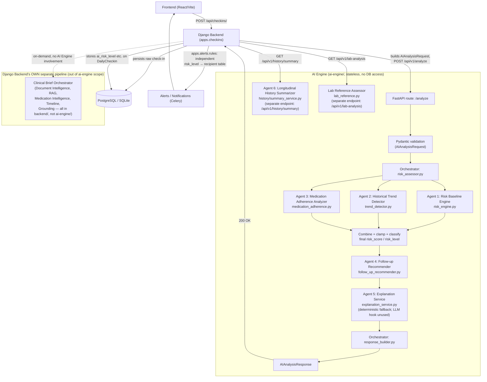
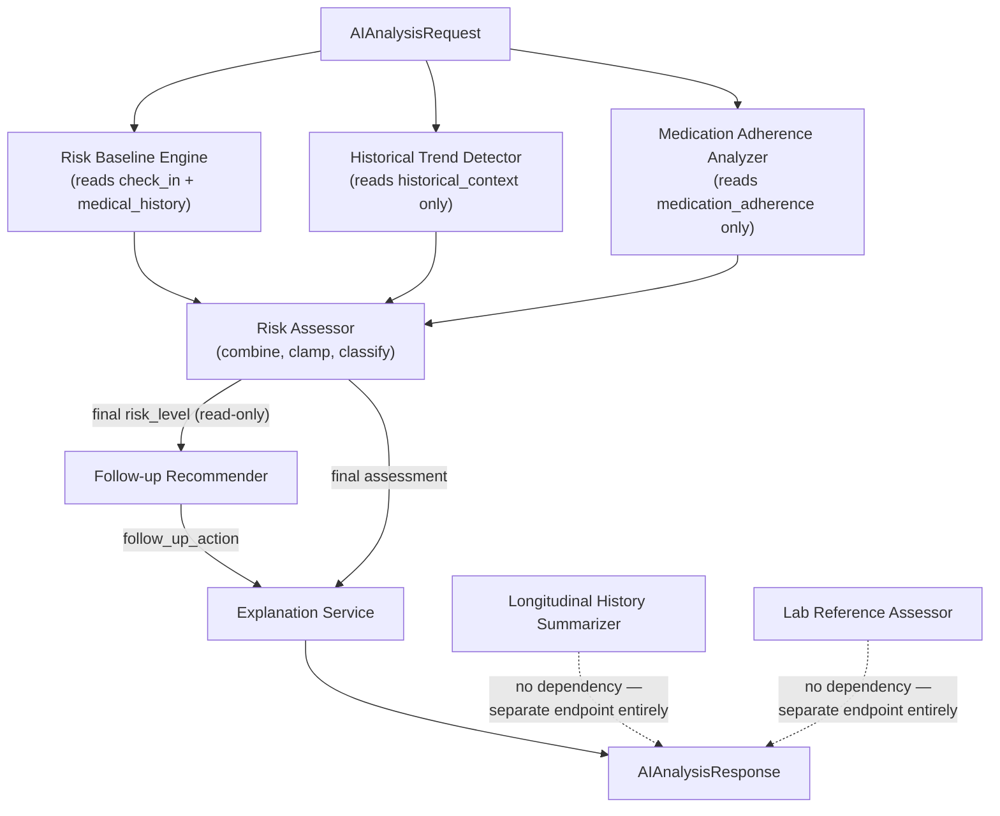

# HealBytes Multi-Agent Architecture & Mentor Explanation Guide

*Prepared from a direct, read-only inspection of the repository on 2026-09-04. Nothing in this document was invented — every claim is traceable to a specific file. Where the codebase's own documentation (`README.md`, `ARCHITECTURE.md`, prior audit reports) already establishes a name or number, this guide uses it rather than inventing a new one. All 315 AI Engine tests were run fresh (`pytest -q` inside `ai-engine/`) and pass.*

---

## 0. Scope and a terminology note (read this first)

Two separate things in this repository get called "multi-agent":

1. **The AI Engine's check-in pipeline** (`ai-engine/app/analysis/*`, `ai-engine/app/history/*`) — a standalone FastAPI service, the module this project's instructions restrict work to. This is the deep-dive of this guide.
2. **The Django backend's Clinical Brief pipeline** (`backend/apps/documents`, `apps/medications/intelligence.py`, `apps/patients/timeline.py`, `apps/patients/clinical_brief.py`, `apps/patients/grounding.py`) — a *separate* pipeline that lives entirely in the Django backend, built by a different contributor, and explicitly out of this project's module boundary. It's covered only at overview depth in §1 and §11 so you have the full picture if a mentor asks about it, but none of the deep "why does this agent exist" analysis in §4/§7 applies to it — that would mean speaking to code this session didn't build and isn't scoped to own.

**On the word "agent" itself:** nothing in this codebase is an LLM-based, autonomous, reasoning agent. Every "agent" here is a small, single-purpose **deterministic Python function or class** — no model weights, no prompts, no tool-calling loop, no autonomous decision-making, no agent-to-agent messaging. The repository's own `ARCHITECTURE.md` says this explicitly: *"'Multi-agent' here describes... specialized, single-purpose deterministic modules, each called in a predetermined order by a plain orchestrating function — not autonomous agents that converse, negotiate, or make independent branching decisions."* This guide keeps that honesty throughout. When you say "agent" to your mentor, be ready to immediately clarify you mean *"a specialized, independently-testable deterministic module in a fixed pipeline,"* not an LLM agent — that's a stronger, more defensible answer than letting them assume otherwise and correcting you.

---

## 1. Repository inspection findings

### A. What agents actually exist (in `ai-engine/`)

Six components the codebase's own docs already number and name, plus one additional deterministic module (lab analysis) that follows the identical pattern but isn't part of the `/analyze` numbering:

| # | Name (as used in repo docs) | File |
|---|---|---|
| 1 | Risk Baseline Engine | `app/analysis/risk_engine.py` |
| 2 | Historical Trend Detector | `app/analysis/trend_detector.py` |
| 3 | Medication Adherence Analyzer | `app/analysis/medication_adherence.py` |
| 4 | Follow-up Recommender | `app/analysis/follow_up_recommender.py` |
| 5 | Explanation Service | `app/analysis/explanation_service.py` |
| 6 | Longitudinal History Summarizer | `app/history/summary_service.py` |
| — | Lab Reference Assessor *(unnumbered in repo docs, same category)* | `app/analysis/lab_reference.py` |

### B. What modules are acting as orchestrators (not agents themselves)

- `app/analysis/risk_assessor.py` — combines the outputs of #1, #2, #3 into one final score/level.
- `app/analysis/response_builder.py` — the top-level composer: calls the risk assessor, then #4, then #5, then assembles the API response.
- `app/api/routes.py` / `app/history/routes.py` — FastAPI route handlers that trigger the above and translate exceptions to HTTP responses.

### C. What is deterministic logic vs. anything AI/ML

**Everything.** There is no ML model, no LLM call, no trained weights, no embeddings, anywhere in `ai-engine/`. `requirements.txt` contains only FastAPI, Uvicorn, and Pydantic — confirmed by reading it directly. Every one of the seven agents above is a pure function over its inputs: same input in, same output out, every time, with no randomness and no I/O. The Explanation Service (#5) has a `Protocol`-typed hook (`ExplanationProvider`) where a real LLM *could* be plugged in later, but no implementation of that protocol exists in the codebase today, and `_default_explanation_service` is constructed with `provider=None` — meaning the deterministic fallback path is the *only* path that ever actually runs right now.

### D. What is planned but not implemented

- An LLM-backed `ExplanationProvider` (the protocol/seam exists; no concrete implementation does).
- A trained ML model to replace any of the rule-based scorers (the module docstrings explicitly say this is a future possibility, not current work — e.g. `risk_engine.py`: *"a future machine-learning model can replace this rule-based implementation later without changing `app/api/routes.py`"*).
- The AI Engine has no database of its own by design (confirmed in `ARCHITECTURE.md` §9) and none is planned — it stays a pure computation service.

### E. How the agents are currently connected

In-process Python function calls inside a single FastAPI request handler — never a network call, never a queue, never agent-to-agent messaging. `response_builder.build_response()` is the literal call chain:

```python
assessment = assess_with_trend(request)                        # -> combines agents 1, 2, 3
follow_up_action = recommend_follow_up(assessment.risk_level)  # -> agent 4
explanation = generate_explanation(assessment, follow_up_action)  # -> agent 5
```

(`app/analysis/response_builder.py`, lines 33–35, read verbatim.)

---

## 2. Agent Inventory

| Agent | Actual Responsibility | Input | Output | Why Needed | What Happens Without It |
|---|---|---|---|---|---|
| **Risk Baseline Engine** (`risk_engine.py`) | Scores the *current* check-in from severity, duration, symptom count, and history presence | `check_in.severity`, `check_in.duration`, `check_in.symptoms` (count), `medical_context.medical_history` (presence) | 0–100 integer score + a factor-by-factor reason string | The current check-in must always be the primary signal — every other agent only nudges this baseline | No score exists at all; nothing downstream (risk level, follow-up, explanation) has anything to compute from |
| **Historical Trend Detector** (`trend_detector.py`) | Detects a consistent worsening/improving pattern across prior check-ins, bounded and evidence-gated | `historical_context.previous_checkins` (severity + timestamp per entry) | ±0/±4/±8 score adjustment + trend label (`improving`/`worsening`/`stable`/`insufficient_data`) | A single bad day and a three-day worsening slide are clinically different signals even at the same current severity | The system would treat every check-in as if it had no history — a patient who has been steadily worsening for a week gets exactly the same priority as one having their first bad day |
| **Medication Adherence Analyzer** (`medication_adherence.py`) | Adds a small, capped concern signal when supplied adherence data shows missed/partial medication-taking | `medical_context.medication_adherence` (per-record `adherence_status`) | +0 to +5 capped score adjustment | Non-adherence is a known, independent risk contributor that symptom severity alone won't capture | A patient reporting mild symptoms while non-adherent to their medication gets no extra scrutiny at all |
| **Risk Assessor** *(orchestrator, not a standalone agent)* (`risk_assessor.py`) | Combines the three signals above, clamps to 0–100, reclassifies into Low/Medium/High | Outputs of the three modules above | Final `risk_score` + `risk_level` | Someone has to combine three independent signals into the one number/level the rest of the system needs | The three modules' outputs would just be three disconnected numbers with no combined verdict |
| **Follow-up Recommender** (`follow_up_recommender.py`) | Maps the *final* risk level onto a deterministic, non-clinical care-coordination action | Final `risk_level` (read-only) | One of 3 fixed action strings | The backend/doctor needs a concrete next step, not just a number | The response would carry a risk score with no actionable next step attached |
| **Explanation Service** (`explanation_service.py`) | Produces a validated, human-readable explanation of the verdict; always has a safe deterministic fallback | Risk level, score, reason, follow-up action (a small structured summary — never raw patient identifiers) | `explanation` string | Doctors and care teams need to read *why* a score is what it is, not just the number | A doctor sees "Medium, 52/100" with no readable justification — technically complete, practically opaque |
| **Longitudinal History Summarizer** (`history/summary_service.py`) | Computes check-in/symptom/vital trends, current medications, latest lab, next open follow-up, and medication adherence from a patient's supplied history — a separate capability, not part of `/analyze` | Patient's full history lists: check-ins, medications, lab tests, appointments, reminder logs | `PatientHistorySummaryResponse` (structured, multi-part summary) | A single check-in's risk score has no sense of the bigger picture; someone needs to compute that bigger picture the same deterministic, evidence-gated way | Doctors reviewing a patient's profile would see raw historical records with no computed trend, adherence rollup, or "what's coming up" summary |
| **Lab Reference Assessor** (`lab_reference.py`) | Classifies a lab technician's free-text result against a known clinical reference range | `test_name`, `result_text` (free text) | Numeric value (if parseable), status (`NORMAL`/`ELEVATED`/`LOW`/`UNKNOWN`), risk level, explanation | Lab results need the same transparent, explainable treatment as check-ins, on their own endpoint since it's a different kind of input entirely | A lab technician's typed-in result would sit unclassified until a doctor manually checks it against a reference range |

---

## 3. Why We Need Multi-Agent Architecture (in HealBytes' own terms)

### Single-Agent Approach

Imagine one function (or one future LLM) that reads the entire request — symptoms, duration, history, trend, medication adherence — and outputs a risk score, a follow-up action, and an explanation, all at once. In HealBytes this would mean one giant function mixing: severity scoring math, trend-detection date/ordinal logic, medication-status counting, care-coordination text selection, and explanation-string generation, all in one place, with one shared set of local variables and no seams between them.

### Multi-Agent Approach

HealBytes instead gives each concern its own small, independently-testable module with one job: `risk_engine.py` only scores the current check-in; `trend_detector.py` only looks at history; `medication_adherence.py` only looks at adherence records; `follow_up_recommender.py` only maps a risk level to an action; `explanation_service.py` only turns a computed assessment into readable text. `risk_assessor.py` is the one place that composes them.

### Why Multi-Agent Is Better for HealBytes, specifically

- **303→315 tests, one file at a time.** Each module has its own dedicated test file (`test_risk_engine.py`, `test_trend_detector.py`, `test_medication_adherence.py`, etc.). A bug in trend detection can be found and fixed by reading and testing one ~200-line file, not by re-deriving the whole pipeline's behavior.
- **Independent evolution, same contract.** The README states this as an explicit design goal: any of the five `/analyze` stages "can replace [it] independently... without changing the API route or the response schema." A future ML model could replace *just* `risk_engine.py` without anyone touching the FastAPI route, the Pydantic schemas, or the other four modules.
- **Bounded blast radius.** `risk_assessor.py`'s own docstring states the actual engineering constraint: the combined magnitude of the trend adjustment (±8) and medication adjustment (+5) is *mathematically* kept below the smallest possible baseline score (15, for `mild` severity). One module misbehaving can shift the result by at most one risk band — it structurally cannot let a secondary signal override the primary one. That guarantee is easy to reason about and test precisely *because* the signals are computed in separate modules with fixed, documented bounds, not tangled together in one scoring blob.
- **Medical data genuinely has independent dimensions.** Current severity, historical trend, and medication adherence are three different *kinds* of evidence about a patient. Scoring them with three different pieces of logic — rather than forcing one function to reason about all three at once — mirrors that real independence.
- **One failure doesn't take down the pipeline.** The Explanation Service is the clearest example: if its (currently unused) LLM-provider hook ever throws, times out, or returns unsafe text, `explanation_service.py`'s own `try/except` catches it and falls back to the deterministic template — the risk score, level, and follow-up action are entirely unaffected because they were already computed and handed off before the Explanation Service ever runs.

---

## 4. Every Agent, Explained with the "WHY" Framework

## Risk Baseline Engine

**1. What does this agent do?** Looks at your current check-in — how severe you say you feel, how long it's lasted, how many symptoms you listed, and whether you have any medical history on file — and turns that into a 0–100 number.

**2. What information does it receive?** `check_in.severity` (mild/moderate/severe), `check_in.duration` (value + unit), `check_in.symptoms` (only the *count*, never the symptom names/content), `medical_context.medical_history` (only *whether any entry exists*, never which).

**3. What does it produce?** An integer 0–100 `risk_score`, plus a plain-English sentence-by-sentence `reason` (e.g. *"Reported severity 'moderate' contributed 40 point(s)... Symptom duration of 30 hour(s) contributed an additional 10 point(s)..."*).

**4. Why did we create this agent?** Every check-in needs *some* prioritization signal the moment it arrives, before any history or medication context is even considered — this is that foundational signal.

**5. Why can't another agent simply do this?** The other agents all depend on *knowing* this baseline exists first — the trend detector adjusts relative to it, the follow-up recommender reacts to the final level derived from it. Nothing else has the current check-in's raw severity/duration/symptom data as its job.

**6. What happens if this agent does not exist?** There is no score to adjust, classify, or explain — the entire pipeline has nothing to start from. Every other agent in `/analyze` is either a bounded adjustment on top of this or reads a `risk_level` that traces back to it.

**7. What happens if this agent gives an incorrect result?** It's a fixed, documented additive formula (see `SEVERITY_SCORES`, `_DURATION_HOURS_*`, `_SYMPTOM_COUNT_*` constants) — an "incorrect result" would mean a bug in that arithmetic, which is exactly what `tests/test_risk_engine.py` (22 test functions) exists to catch before it ships. There's no runtime uncertainty to handle (no model output to validate) — correctness here is a testing/code-review problem, not a runtime-safety one.

**8. Who uses this agent's output?** `risk_assessor.py` (combines it with trend + medication adjustments); ultimately `response_builder.py`, `follow_up_recommender.py`, and `explanation_service.py` all act on the *final* score/level this baseline seeded.

**9. Is this AI-based, rule-based, or hybrid?** Rule-based/deterministic. Hand-picked, documented engineering weights (explicitly *not* medically validated — the module docstring says so directly), not learned from data.

**10. One-line explanation for your mentor:** *"The Risk Baseline Engine turns today's reported symptoms into a transparent, explainable starting score — the one signal every other stage in the pipeline builds on."*

## Historical Trend Detector

**1. What does this agent do?** Looks at a patient's last several check-ins and asks: is their reported severity consistently getting worse, consistently getting better, or not showing a clear pattern?

**2. What information does it receive?** `historical_context.previous_checkins` — a list of past `severity` + `timestamp` pairs (nothing from the *current* check-in).

**3. What does it produce?** A `TrendResult`: a label (`improving`/`worsening`/`stable`/`insufficient_data`), a confidence (`weak`/`strong`/`none`), and a bounded `score_adjustment` (0, ±4, or ±8).

**4. Why did we create this agent?** A patient reporting "moderate" today after three days of "mild → moderate → severe" is a materially different situation than a patient reporting "moderate" as an isolated one-off — the baseline engine alone can't see that difference because it only ever looks at the current check-in.

**5. Why can't another agent simply do this?** The Risk Baseline Engine deliberately never reads `historical_context` (documented in its own module docstring) — the two are kept separate on purpose so the primary signal (current condition) can never be diluted by mixing in historical logic.

**6. What happens if this agent does not exist?** A genuinely worsening trend never nudges the score — every check-in is judged purely in isolation, which is a real loss of clinically-relevant context for follow-up prioritization.

**7. What happens if this agent gives an incorrect result?** It cannot swing the outcome very far even if it's "wrong" by construction: the max adjustment (±8) is hard-bounded well below the smallest possible baseline contribution (15). The evidence-gating rules are also conservative by design — fewer than 2 historical check-ins always yields `insufficient_data` (adjustment 0), and anything that isn't a *strictly* monotonic sequence is `stable` (adjustment 0), never a forced direction.

**8. Who uses this agent's output?** `risk_assessor.py`, which adds `trend_result.score_adjustment` into the combined score, and includes `trend_result.reason_fragment` in the final `reason` text.

**9. Is this AI-based, rule-based, or hybrid?** Rule-based/deterministic. A fixed ordinal comparison (mild=1, moderate=2, severe=3) over sorted history — no learning, no probability estimation.

**10. One-line explanation for your mentor:** *"The Trend Detector adds a small, capped nudge when a patient's history shows a clear, evidence-gated worsening or improving pattern — it can never override what the patient is reporting today."*

## Medication Adherence Analyzer

**1. What does this agent do?** Checks whether the patient's supplied medication-adherence records show any concern (partial or non-adherence), and adds a small, capped amount to the score if so.

**2. What information does it receive?** `medical_context.medication_adherence` — a list of records, each with an `adherence_status` (`adherent`/`partially_adherent`/`non_adherent`/`unknown`). It does *not* read `medication_name` or `last_taken` — no per-drug identity or timing logic exists here.

**3. What does it produce?** A `MedicationAssessment`: a `score_adjustment` capped at +5 total (regardless of how many concerning records exist), plus a reason fragment.

**4. Why did we create this agent?** Medication non-adherence is a recognized, independent risk contributor to a patient's actual condition — a symptom-only score would miss it entirely.

**5. Why can't another agent simply do this?** It's the only agent that reads `medication_adherence` data at all in the `/analyze` pipeline; the baseline and trend agents are explicitly scoped away from it (see both modules' own docstrings).

**6. What happens if this agent does not exist?** A patient who isn't taking their medication as prescribed gets scored identically to one who is — the adherence signal is simply invisible to the system.

**7. What happens if this agent gives an incorrect result?** Same shape of answer as the trend detector: the cap (+5) is deliberately smaller than the smallest baseline contribution (15), so even a maximally "wrong" adjustment can't flip an obviously low-risk check-in to high, or vice versa. `unknown` adherence is explicitly never penalized — missing data can't accidentally produce a false concern signal.

**8. Who uses this agent's output?** `risk_assessor.py` — same composition point as the Trend Detector.

**9. Is this AI-based, rule-based, or hybrid?** Rule-based/deterministic. Fixed per-status point values (`ADHERENCE_CONTRIBUTION` dict), summed and capped — no inference involved.

**10. One-line explanation for your mentor:** *"The Medication Adherence Analyzer adds a small, capped concern signal only when the supplied data actually shows an adherence problem — and never penalizes missing adherence data."*

## Follow-up Recommender

**1. What does this agent do?** Takes the *final*, already-computed risk level and maps it to one fixed, plain-English next-step recommendation.

**2. What information does it receive?** Only the final `RiskLevel` (`Low`/`Medium`/`High`) — nothing else, read-only.

**3. What does it produce?** One of exactly three fixed strings (e.g. `High` → *"Prompt physician review is recommended based on the current risk assessment."*).

**4. Why did we create this agent?** A risk score alone doesn't tell a doctor or the backend what to *do* next — care coordination needs an explicit action, not just a number.

**5. Why can't another agent simply do this?** It has to run strictly *after* the final risk level is settled (baseline + trend + medication all combined and clamped) — none of the scoring agents have access to that final, composed value themselves.

**6. What happens if this agent does not exist?** The response would carry a risk score and level but no actionable next step — every downstream consumer (backend, doctor UI) would have to hardcode its own score→action mapping, duplicating logic that belongs in one place.

**7. What happens if this agent gives an incorrect result?** It's a pure 3-entry dictionary lookup (`FOLLOW_UP_RECOMMENDATIONS`) — there's no runtime failure mode beyond a coding bug, which `tests/test_follow_up_recommender.py` (11 tests) is built to catch. By design it can *never* recommend emergency services or a treatment change, regardless of risk level — that ceiling is enforced by what's literally in the mapping, not by a runtime check.

**8. Who uses this agent's output?** `response_builder.py` (puts it directly on the response) and `explanation_service.py` (folds it into the generated explanation text).

**9. Is this AI-based, rule-based, or hybrid?** Rule-based/deterministic — the simplest agent in the pipeline, a pure dictionary lookup.

**10. One-line explanation for your mentor:** *"The Follow-up Recommender turns a risk level into a concrete, safe, non-clinical next step — it never feeds back into or changes the score itself."*

## Explanation Service

**1. What does this agent do?** Turns the already-computed risk assessment and follow-up action into one readable paragraph a doctor or care team can act on without decoding raw numbers.

**2. What information does it receive?** Only a small structured summary: `risk_level`, `risk_score`, `reason`, `alert_recipient`, `follow_up_action` — never raw patient identifiers or the original free-text symptoms, by design (stated explicitly in the module docstring, "data minimization").

**3. What does it produce?** An `explanation` string. Always has a guaranteed deterministic fallback (e.g. *"The assessment indicates Medium risk (score: 52.0/100) based on the deterministic evaluation of reported symptoms, duration, and context. Care-team review and closer follow-up are recommended."*).

**4. Why did we create this agent?** Raw scores and reason fragments from the other agents are technically complete but not always the friendliest read for a busy care team — this agent exists purely to improve readability/explainability without touching the underlying verdict.

**5. Why can't another agent simply do this?** It has to run last — it needs the *final* risk assessment and the *already-computed* follow-up action as its inputs, so structurally it can only follow, never precede, the other five.

**6. What happens if this agent does not exist?** The response would still be complete and correct (risk score, level, follow-up action are unaffected — this agent is strictly downstream) but less readable; care teams would need to interpret the raw factor-based `reason` text themselves.

**7. What happens if this agent gives an incorrect result?** This is the one agent explicitly engineered for a "provider gives a bad answer" scenario, because it has a `Protocol`-based pluggable LLM-provider hook for the future. Any candidate explanation — from that provider, if one is ever configured — is run through `validate_explanation()`: rejected if it's empty, too long (>1000 chars), contradicts the computed risk level (e.g. claims "High risk" when the level is Low), or contains any of ~26 forbidden clinical/emergency phrases (`"diagnosed with"`, `"prescribe"`, `"call 911"`, etc.). Any rejection, exception, or timeout falls back to the deterministic template — never raises a 500, never surfaces unsafe text.

**8. Who uses this agent's output?** `response_builder.py` puts it directly on the final `AIAnalysisResponse.explanation` field — this is the last stop before the API response leaves the system.

**9. Is this AI-based, rule-based, or hybrid?** **Hybrid by design, but currently 100% deterministic in practice.** The architecture supports a pluggable AI/LLM provider (`ExplanationProvider` protocol) with strict validation around it, but no concrete provider is implemented or configured anywhere in the codebase today — `ExplanationService()` is always constructed with `provider=None`, so every explanation you'll actually see right now comes from `generate_fallback_explanation()`, the deterministic template.

**10. One-line explanation for your mentor:** *"The Explanation Service turns the verdict into a readable sentence and is built to safely support an LLM later — but today it's a validated deterministic template, with no risk of an ungrounded or unsafe explanation reaching a doctor."*

## Longitudinal History Summarizer

**1. What does this agent do?** Given a patient's full supplied history (check-ins, medications, lab tests, appointments, medication-reminder logs), computes a structured summary: how many check-ins, days since the last one, symptom trend, per-vital trend, currently active medications, the latest completed lab, the next open appointment, and an overall medication-adherence rollup.

**2. What information does it receive?** `PatientHistoryRequest` — five separate lists of history records, all supplied by the caller (the AI Engine has no database, so nothing here is fetched internally).

**3. What does it produce?** `PatientHistorySummaryResponse` — a `PatientHistory` object bundling all nine computed fields listed above.

**4. Why did we create this agent?** `/analyze` answers "what's the risk of *this* check-in"; a doctor reviewing a patient's profile needs a completely different question answered — "what does this patient's whole recent history look like" — and that needs its own dedicated computation, not a repurposing of the check-in scorer.

**5. Why can't another agent simply do this?** It's a genuinely separate capability with a separate request/response contract (`app/history/schemas.py`, deliberately kept apart from `app/schemas/request.py` per that module's own docstring) and a separate endpoint (`/api/v1/history/summary` vs. `/api/v1/analyze`) — none of the six `/analyze` agents have access to a patient's full history lists as input.

**6. What happens if this agent does not exist?** A doctor's patient-profile view would have only raw historical records with no computed trend, no adherence rollup, and no "what's the next open follow-up" answer — all of that would have to be recomputed ad hoc somewhere else (likely duplicating logic already proven correct here).

**7. What happens if this agent gives an incorrect result?** Same testing-driven answer as the other deterministic agents: `tests/test_history_summary_service.py` has 33 dedicated test functions, the largest test file in the suite, covering ordering edge cases (tie-breaking, missing timestamps, mixed `result_date`/`created_at` fallbacks) explicitly. Every "can't compute this" case (e.g. fewer than 2 check-ins for a symptom trend) returns an explicit `insufficient_data`/`None`, never a guessed value.

**8. Who uses this agent's output?** The Django backend, via `get_patient_history_summary()` in `backend/apps/checkins/ai_client.py`, which calls `POST /api/v1/history/summary` and returns the parsed dict (or `None` on failure) to whatever view requested it.

**9. Is this AI-based, rule-based, or hybrid?** Rule-based/deterministic — pure counting, sorting, and date arithmetic; explicitly documented as "nothing is inferred by an LLM or ML model" in the module's own docstring.

**10. One-line explanation for your mentor:** *"The Longitudinal History Summarizer is a separate capability from risk scoring — it turns a patient's raw historical records into a structured, doctor-readable summary using the same deterministic, evidence-gated philosophy as the rest of the engine."*

## Lab Reference Assessor

**1. What does this agent do?** Takes a lab technician's free-text result for a known test type and classifies it against a fixed clinical reference range.

**2. What information does it receive?** `test_name` (one of 8 fixed test types: CBC, BLOOD_GLUCOSE, LIPID_PROFILE, HBA1C, KFT, LFT, TFT, URINALYSIS) and `result_text` (free text, e.g. `"6.8%"` or `"all normal"`).

**3. What does it produce?** A parsed numeric value (if one could be extracted), the reference range, a status (`NORMAL`/`ELEVATED`/`LOW`/`UNKNOWN`), a `risk_level`, and an explanation.

**4. Why did we create this agent?** Lab results are a structurally different kind of input (a number/keyword against a known clinical range) from a symptom check-in — it doesn't fit the severity/duration/symptom-count shape the other agents are built around, so it gets its own endpoint and its own logic.

**5. Why can't another agent simply do this?** None of the check-in agents have any lab-reference-range data or free-text-parsing logic; this is the only agent in the AI Engine that does regex-based numeric extraction and reference-range comparison.

**6. What happens if this agent does not exist?** A lab technician's typed-in result would sit as raw, unclassified text until a doctor manually checks it against a reference range themselves — no automatic flagging of an elevated/abnormal value.

**7. What happens if this agent gives an incorrect result?** If no numeric value can be parsed, it deliberately falls back to keyword matching (`"elevated"`, `"normal"`, etc.) rather than silently discarding the result, and if *neither* a number nor a recognizable keyword is found, it returns `UNKNOWN`/`LOW` risk with an explicit note that the doctor should review it — never a guessed classification.

**8. Who uses this agent's output?** The Django backend, via `analyze_lab_result()` in `backend/apps/labtests/ai_client.py`, called after a lab technician submits a result — "additive, never a blocker on recording a lab result" per that client's own docstring.

**9. Is this AI-based, rule-based, or hybrid?** Rule-based/deterministic — regex extraction plus a fixed reference-range dictionary, explicitly documented as "No ML/LLM anywhere in this module."

**10. One-line explanation for your mentor:** *"The Lab Reference Assessor gives lab results the same transparent, explainable treatment as check-ins — parsed against known reference ranges, with a safe keyword fallback and an explicit UNKNOWN when nothing can be determined."*

---

## 5. The Complete Multi-Agent Workflow (the `/analyze` path)

### Step 1 — Patient Data Enters
The Django backend builds an `AIAnalysisRequest` JSON payload from a `DailyCheckin` row (`backend/apps/checkins/ai_client.py::_build_request_payload`) — symptoms, a severity derived from a 0–10 pain scale, a placeholder 1-day duration, medical history text, medication-adherence records computed from reminder logs, and up to 10 prior check-ins for trend context.

### Step 2 — Data Preparation
`POST /api/v1/analyze` hits FastAPI. Pydantic validates the payload against `AIAnalysisRequest` (strict types, required fields, `extra="forbid"`) before any application code runs. An invalid payload never reaches an agent — it gets a `422` immediately.

### Step 3 — Risk Baseline Engine
Reads `check_in` + `medical_context.medical_history` → produces a 0–100 baseline score and its reason.

### Step 4 — Historical Trend Detector
Reads `historical_context.previous_checkins` (independently of Step 3 — no shared state) → produces a ±0/±4/±8 adjustment.

### Step 5 — Medication Adherence Analyzer
Reads `medical_context.medication_adherence` (also independent of Steps 3–4) → produces a +0 to +5 adjustment.

*Why these three don't repeat each other's work:* each reads a distinct, non-overlapping slice of the request (current check-in vs. history vs. medication records) — there would be nothing to gain and real risk of double-counting if, say, the Trend Detector also tried to re-score current severity.

### Step 6 — Risk Assessor (composition)
Sums baseline + trend adjustment + medication adjustment, clamps to `[0, 100]`, reclassifies into `Low`/`Medium`/`High` using the same thresholds Step 3 alone would have used. *Why Step 6 needs Steps 3–5's output specifically, not raw request data:* it never re-reads the original symptoms/history/medication fields itself — it only combines the three already-computed numbers, which is what keeps the "bounded adjustment" safety guarantee simple to state and test.

### Step 7 — Follow-up Recommender
Reads only the *final* `risk_level` from Step 6 → maps it to one of 3 fixed action strings.

### Step 8 — Explanation Service
Reads the final assessment (from Step 6) + the follow-up action (from Step 7) → produces the `explanation` string, with strict validation and a guaranteed deterministic fallback.

### Final Step — Final Patient-Friendly Response
`response_builder.build_response()` assembles `AIAnalysisResponse`: `request_id`, `timestamp`, `risk_level`, `risk_score`, `reason`, `alert_recipient`, `follow_up_action`, `explanation`, `model_version`. This is returned as `200 OK` to the Django backend, which stores the relevant fields on the `DailyCheckin` row and separately decides alert/email routing (see §12).

---

## 6. A Simple Real-World Patient Example

**Scenario:** Priya has type 2 diabetes. She's been logging daily check-ins. Her last three check-ins reported mild → moderate → moderate symptoms (a partial worsening pattern, not strictly monotonic). Today she reports "severe" fatigue and dizziness, lasting about 30 hours, with 3 symptoms listed. Her medication-adherence records show one `partially_adherent` entry for her metformin.

```text
Patient Check-in (severe, 30h, 3 symptoms) + Medical History + Medication Adherence + Prior 3 Check-ins
        │
        ▼
Risk Baseline Engine  →  severity(severe)=70 + duration(30h→+10) + symptoms(3→+10) + history(+5) = 95
        │  (sees only today's data — nothing about prior check-ins or medication)
        ▼
Historical Trend Detector  →  ordinals [1,2,2]: not strictly increasing → 'stable', adjustment = 0
        │  (sees only the 3 prior check-ins)
        ▼
Medication Adherence Analyzer  →  1 partially_adherent record → +3 adjustment (well under the +5 cap)
        │  (sees only the adherence records)
        ▼
Risk Assessor  →  95 + 0 + 3 = 98, clamped to [0,100] → 98 → High
        │
        ▼
Follow-up Recommender  →  High → "Prompt physician review is recommended based on the current risk assessment."
        │
        ▼
Explanation Service  →  "The assessment indicates High risk (score: 98.0/100) based on the deterministic
                          evaluation of reported symptoms, duration, and context. Prompt physician review
                          is recommended based on the current risk assessment."
        │
        ▼
Final Response  →  risk_level=High, risk_score=98.0, alert_recipient=physician, explanation as above
```

Separately, if her doctor opens her patient profile, the **Longitudinal History Summarizer** (a different endpoint, not part of the flow above) would independently report: `symptom_trend` across her check-ins, her `medication_adherence.overall_status` computed from reminder-dispatch logs (a different, from-scratch computation than the +3 nudge above — see §1's note on the two independent medication-adherence implementations), her active medications, and her next open appointment, if any.

Every stage above "sees X and produces Y" strictly from its own documented inputs — nothing here was invented for the example; the arithmetic follows the exact constants in `risk_engine.py`, `trend_detector.py`, and `medication_adherence.py`.

---

## 7. What If We Remove an Agent?

| If We Remove | What Still Works | What Breaks / Becomes Weaker | Why It Matters |
|---|---|---|---|
| Risk Baseline Engine | Nothing — this is the foundation | Everything: no score, no level, no downstream output at all | It's not a "nice to have" agent, it's the root of the whole `/analyze` pipeline |
| Historical Trend Detector | Baseline scoring, medication adjustment, follow-up, explanation all still work | A patient's worsening or improving pattern over time is invisible to the score | A steadily-worsening patient gets no extra prioritization over a one-off bad day |
| Medication Adherence Analyzer | Everything else in `/analyze` still works | Adherence problems never nudge the score | A non-adherent patient with mild symptoms gets no extra scrutiny |
| Risk Assessor (orchestrator) | The three scoring agents still each independently compute a number | Nothing combines them — there is no final score or level at all | This is a composition point, not optional plumbing — remove it and the pipeline has no output |
| Follow-up Recommender | Risk score/level are still computed and correct | The response has no actionable next step | Backend/doctor would need to duplicate a score→action mapping elsewhere |
| Explanation Service | Risk score, level, and follow-up action are entirely unaffected (this agent is strictly downstream) | Responses lose the readable paragraph; only the factor-based `reason` string remains | Readability/explainability drops, but nothing about correctness or safety is at risk — proof this agent's boundary was drawn correctly |
| Longitudinal History Summarizer | `/analyze` is completely unaffected — separate endpoint | Doctors lose the computed trend/adherence-rollup/next-follow-up view of a patient's history | It's an independent capability, not a dependency of check-in scoring |
| Lab Reference Assessor | Everything else is unaffected — separate endpoint entirely | Lab results go unclassified until manually reviewed | Same "additive, not a blocker" design as the checkin pipeline — its absence degrades a different workflow, not this one |

---

## 8. Agent Independence

The actual architecture, verified from the code:

```text
                    ┌── Risk Baseline Engine ──────┐
AIAnalysisRequest ──┼── Historical Trend Detector ─┼──→ Risk Assessor (combine + clamp + classify)
                    └── Medication Adherence Analyzer┘         │
                                                                 ▼
                                                      Follow-up Recommender
                                                                 │
                                                                 ▼
                                                      Explanation Service
                                                                 │
                                                                 ▼
                                                        AIAnalysisResponse
```

- **Risk Baseline Engine, Historical Trend Detector, Medication Adherence Analyzer:** logically **independent** of each other — none reads another's output, each reads a distinct slice of the request. (Currently executed sequentially, one Python call after another, in a single request thread — see §15 on why this isn't literally parallel today.)
- **Risk Assessor:** **hierarchical/aggregating** — depends on all three above finishing first.
- **Follow-up Recommender → Explanation Service:** strictly **sequential** — each depends on the previous stage's output (final risk level, then the follow-up action).
- **Longitudinal History Summarizer and Lab Reference Assessor:** **completely independent** of the entire chain above — separate endpoints, separate request/response contracts, never invoked from `/analyze` or from each other.

There is no dynamic branching anywhere in this diagram — `ARCHITECTURE.md` states it directly: *"There is no dynamic decision about 'which agents are required' — every request always exercises the same pipeline."*

---

## 9. The Orchestrator

**What is the orchestrator?** Two things, at two levels, both plain Python functions — not a separate "orchestrator agent" with its own intelligence:

- `risk_assessor.assess_with_trend()` — the **composition orchestrator**: combines the three scoring agents' outputs.
- `response_builder.build_response()` — the **top-level pipeline orchestrator**: calls the composition orchestrator, then the Follow-up Recommender, then the Explanation Service, then assembles the final response object.

**Why do we need it?** Someone has to call the agents in the right order and pass the right data between them. Without an orchestrator, the FastAPI route handler itself would have to inline all of this sequencing logic, which is exactly what `response_builder.py`'s own docstring says it exists to avoid — it's "the seam between the fixed external contract... and whatever internally produces a `RiskAssessment`."

**What would happen without it?** The route handler (`app/api/routes.py::analyze_checkin`) would have to know about and directly call all six agents itself, tangling HTTP concerns (request/response, error handling) with pipeline sequencing — harder to test either in isolation.

**Does the orchestrator make medical decisions?** **No.** It performs exactly two kinds of operations: (1) arithmetic — summing, clamping bounded numbers already computed by the agents, and (2) a fixed lookup — classifying a score into Low/Medium/High via hardcoded thresholds (`LOW_UPPER_BOUND = 34`, `MEDIUM_UPPER_BOUND = 69`), the same thresholds `risk_engine.py` itself would use. It never introduces new judgment of its own about the patient — it only combines judgments already made, deterministically, by the agents it calls.

---

## 10. AI vs. Deterministic Logic

| Component | Type | Why This Approach |
|---|---|---|
| Risk Baseline Engine | Deterministic/rule-based | Transparent, testable, explainable scoring is more valuable than marginal accuracy gains at this stage — and the module is explicitly seamed for a future model to replace it |
| Historical Trend Detector | Deterministic/rule-based | Evidence-gating rules (min 2/3 check-ins for any/strong trend) are exactly the kind of explicit, auditable logic that shouldn't be left to a black-box model in a hackathon MVP with no clinical validation |
| Medication Adherence Analyzer | Deterministic/rule-based | Same reasoning — a fixed, bounded, auditable per-status weight table |
| Risk Assessor (orchestrator) | Deterministic | Pure arithmetic (sum, clamp) + fixed-threshold classification — nothing here benefits from being "AI" |
| Follow-up Recommender | Deterministic/rule-based | A 3-entry dictionary lookup; introducing any inference here would add risk (e.g. an LLM improvising an unsafe recommendation) with zero benefit |
| Explanation Service | **Hybrid architecture, deterministic in practice today** | Built to *support* an LLM for better-phrased explanations later, but currently runs 100% on the deterministic fallback template — no provider is configured |
| Longitudinal History Summarizer | Deterministic | Pure counting/sorting/date arithmetic over structured data — no natural-language or unstructured input to interpret |
| Lab Reference Assessor | Deterministic (regex + reference table) | Numeric extraction and range comparison is a solved, auditable problem; no model needed |

**Why not use an LLM for every operation?** Two reasons this codebase demonstrates concretely: (1) deterministic calculations (arithmetic, date comparisons, dictionary lookups) are things a rule-based function does perfectly and instantly, with zero chance of hallucination — routing that through an LLM would add latency, cost, and a new failure mode for no accuracy gain; (2) structured data processing needs predictability a probabilistic model doesn't naturally give you — the entire safety story of this pipeline (bounded adjustments, fixed thresholds, guaranteed-present response fields) depends on every stage behaving identically given identical input, every time. LLMs are reserved, in this architecture's *design* (not yet its implementation), for exactly one place: turning an already-computed, already-safe structured result into better-phrased natural language — where reasoning/language interpretation is actually valuable and a wrong output is caught by validation before it ever reaches a user.

---

## 11. Data Flow

```text
Frontend (React/Vite)
   ↓  POST /api/checkins/  (JWT bearer token)
Django Backend (apps.checkins)
   ↓  persists raw check-in, then calls ai_client.analyze_checkin()
   ↓  POST {AI_ENGINE_URL}/api/v1/analyze  (plain HTTP/JSON, backend-initiated only)
AI Engine (FastAPI) — Pydantic validation
   ↓
Risk Baseline + Trend Detector + Medication Adherence Analyzer  (in-process function calls)
   ↓
Risk Assessor → Follow-up Recommender → Explanation Service
   ↓
AIAnalysisResponse (200 OK)  ←── or a 422 (invalid request) / 500 (internal error), never leaking internals
   ↓
Django Backend — parses response, stores ai_risk_level/ai_risk_score/ai_notes/
                 ai_recommended_action/ai_notification_recipient on DailyCheckin
   ↓
apps.alerts — applies its own independent routing table against risk_level
   (see §12 — this is NOT the same as the AI Engine's alert_recipient field)
   ↓
Frontend — polls/re-fetches to display updated risk status
```

What crosses each boundary: Frontend↔Backend carries the raw check-in fields (symptoms, pain level, mood, vitals) plus a JWT. Backend↔AI Engine carries only the fixed `AIAnalysisRequest`/`AIAnalysisResponse` JSON shapes — no database credentials, no ORM objects, ever cross that boundary; the AI Engine has no database access at all (`ARCHITECTURE.md` §8, confirmed directly in `ai-engine`'s code — no DB client anywhere in `requirements.txt` or the source).

*(For completeness: a separate, on-demand flow — the Django backend's own Clinical Brief pipeline, §1 point 2 — runs entirely inside Django when a doctor requests a patient's AI summary, with no AI Engine involvement at all. It's out of this guide's deep-dive scope; see `ARCHITECTURE.md` §5–§7 if your mentor asks about it.)*

---

## 12. Database Connection

- **Which data comes from the database?** All of it, but never accessed by the AI Engine directly — the Django backend queries `DailyCheckin`, `Medication`, `MedicationReminderLog`, `LabTestRequest`/`Result`, `Appointment` via the Django ORM, then serializes exactly what the AI Engine's fixed contract needs.
- **Which service retrieves it?** `backend/apps/checkins/ai_client.py` (for `/analyze` and `/history/summary` payloads) and `backend/apps/labtests/ai_client.py` (for `/lab-analysis`) — both are Django-side HTTP clients, not part of `ai-engine/`.
- **Do agents directly access the database?** No — confirmed by reading every file in `ai-engine/`: no DB driver, no ORM, no connection string anywhere. This is a deliberate design property, stated in `ARCHITECTURE.md` §8: *"The AI Engine has no database credentials and no ORM access."*
- **Does the backend act as a data boundary?** Yes, entirely — it's the only thing that ever reads the database, and it's the only thing that ever calls the AI Engine.
- **What data is passed to the AI Engine?** Exactly and only what the request-body schemas define — nothing implicit, nothing fetched on the AI Engine's side.
- **Are agent outputs stored?** Yes, but by the **backend**, not the AI Engine — `apps.checkins.tasks.process_checkin_ai_analysis` writes `ai_risk_level`, `ai_risk_score`, `ai_notes`, `ai_recommended_action`, `ai_notification_recipient` onto the `DailyCheckin` row after the AI Engine responds. The AI Engine itself stores nothing — it's a pure computation service, confirmed directly: no persistence code exists in `ai-engine/`.
- **Where are final results returned?** Back to the Django backend as the HTTP response body; the backend then decides what to persist and whether to route an alert/email.

One nuance worth knowing precisely for a mentor Q&A: the AI Engine's `alert_recipient` field (`none`/`care_team`/`physician`/`emergency_services`) is explicitly documented as a **placeholder classification only** — read `risk_engine.py`'s own comment: *"Phase 1 does NOT perform, queue, or trigger any real alert or notification delivery."* The actual alert-routing decision in production is made independently by `backend/apps/alerts/rules.py`, which has its own separate risk-level-to-recipient table (confirmed by reading it directly) — it does not consume the AI Engine's `alert_recipient` field at all. The two happen to encode similar intent but are not the same mechanism.

---

## 13. Why This Architecture Is Good for a Healthcare-Adjacent Project

- **Separation of responsibilities** means a bug in trend detection is provably isolated from a bug in medication scoring — they're different files, different tests, different blast radius.
- **Traceability** is built into the response contract itself: `model_version` (`rule-engine-v4`) identifies exactly which composed pipeline produced a result, and the `reason` string is assembled from real, cited factors ("severity contributed 40 points... duration contributed 10 points...") rather than a black-box number.
- **Explainability** is a first-class design goal, not an afterthought — every agent's docstring states what it does and doesn't claim, and the Explanation Service's entire purpose is readability.
- **Testing** is dramatically easier with small, pure, single-purpose functions — 315 passing tests across 14 files (verified directly, `pytest -q` inside `ai-engine/`), each targeted at one module's specific behavior and edge cases.
- **Predictable workflows**: every request runs the exact same fixed sequence, with no hidden branching — a property `ARCHITECTURE.md` states explicitly and this guide's own reading of the code confirms.
- **Reduced unnecessary "AI" calls**: nothing here calls a model when a lookup table or arithmetic would do — see §10.
- **Easier debugging**: a wrong `risk_score` can be traced to exactly one of three modules by re-reading `reason`, which cites each contributing factor by name.
- **Maintainability & independent improvement**: the README states directly that any of the five `/analyze` modules "can replace `app/analysis/risk_engine.py`... independently, without changing the API or response contract" — a real architectural property, not aspirational language, enforced by the fixed Pydantic schemas at the boundary.

**Important caveat, stated plainly (and required by the source material for this guide):** none of the above makes this system *medically* safe or clinically accurate on its own. Every module's docstring in this codebase says the same thing in its own words: this is an engineering baseline for follow-up prioritization, its thresholds are hand-picked (not clinically derived), and it should not be presented to clinicians or patients as diagnostic. AI-Engine outputs here are decision-support/prioritization signals, not a diagnosis, and would need real clinical validation and governance before any real-world deployment — that's the codebase's own stated position, not an external caveat added by this guide.

---

## 14. Failure Handling

**Current implementation (verified from code):**

- **Invalid request payload:** Pydantic rejects it before any agent runs; `app/core/exceptions.py` returns a structured `422` with an `errors` list.
- **Unexpected exception inside `build_response()` or `assess_lab_result()`:** caught by the route handler's own `try/except` (`app/api/routes.py`), logged via `logger.exception(...)`, and converted to a generic `500` — "Internal error while analyzing the check-in" — never leaking a stack trace or internal details to the caller.
- **Explanation provider failure specifically:** `ExplanationService.generate_explanation()` has its own inner `try/except` — any exception, or any output that fails `validate_explanation()`, is logged as a warning and silently replaced with the deterministic fallback. This never surfaces as an error to the caller at all — the response still returns `200` with a safe explanation.
- **AI Engine unreachable from the backend's side:** `backend/apps/checkins/ai_client.py::analyze_checkin()` catches `requests.RequestException`/`ValueError`, logs a warning, and returns an `"unavailable"` sentinel result — the check-in still saves with `ai_risk_level="unavailable"`; no alert or email fires for that entry (confirmed directly in `ai_client.py` and `ARCHITECTURE.md` §5).
- **`AI_ENGINE_URL` not configured at all:** same `"unavailable"` sentinel path, logged as info rather than a warning — a deliberately soft failure for local/partial environments.
- **Does the pipeline continue on a partial agent failure?** There's no per-agent try/except *inside* `/analyze` — the three scoring agents, the assessor, the recommender, and the explanation service (apart from its own internal fallback) are not individually fault-isolated from each other; an unhandled exception in *any* of them propagates up to the route handler's single outer `try/except` and becomes one generic `500` for the whole request. The one exception to this is the Explanation Service, which is deliberately self-contained (§ above).
- **Empty/malformed history data:** never crashes — every "not enough data" case (fewer than 2 check-ins for a trend, zero medications, no completed lab results) returns an explicit `insufficient_data`/`None`/empty value rather than raising, confirmed across `trend_detector.py` and `history/summary_service.py`.

**Recommended future improvement** *(not implemented — stated separately per your instructions, not to be confused with the above)*:
- Per-agent fault isolation inside `/analyze` (so a bug in, say, the Trend Detector degrades gracefully to "trend unavailable" rather than failing the entire request) is not currently implemented — today it's all-or-nothing within one route handler.
- No explicit request timeout is enforced *inside* the AI Engine itself for its own processing (the backend enforces `AI_ENGINE_TIMEOUT_SECONDS` on its side of the HTTP call, but that's a backend-side safeguard, not something in `ai-engine/`).
- No structured metrics/observability (request duration, per-agent timing, error rate dashboards) exist in the codebase today — only plain `logging.basicConfig` text logs (`app/core/logging.py`).

---

## 15. Parallel vs. Sequential Execution

**Currently: sequential.** Every call in `response_builder.build_response()` and `risk_assessor.assess_with_trend()` is a plain, synchronous Python function call, one after another, in a single thread, inside one FastAPI request handler. There is no `asyncio.gather`, no threading, no multiprocessing, and no queue anywhere in `ai-engine/` — confirmed by reading every module; none imports `asyncio`, `threading`, `concurrent.futures`, or a task queue client.

**Why this is fine today:** the actual computations are all fast, pure, in-memory operations (arithmetic, sorting small lists, dictionary lookups) — there's no I/O-bound work (no network calls, no database queries) inside any agent to justify the complexity of concurrency.

**Where parallelism *could* apply, if ever needed:** the Risk Baseline Engine, Historical Trend Detector, and Medication Adherence Analyzer are logically independent of each other (§8) — none reads another's output. Running them concurrently (e.g. via a thread pool or `asyncio.gather` if they ever become I/O-bound, such as calling out to a trained model service) is architecturally possible without restructuring the pipeline.

> **This is a possible optimization, not part of the current implementation.** Nothing in the codebase runs these three agents in parallel today.

---

## 16. The Simple, Beginner-Friendly Version

Think of HealBytes' AI Engine like a small team of specialists reviewing one patient check-in, each looking at a different piece of the picture:

- One specialist looks only at *today's* reported symptoms and turns that into a starting score.
- One specialist looks only at the *pattern* across recent check-ins — is it getting better, worse, or steady?
- One specialist looks only at whether the patient has been taking their medication.
- One specialist combines what the first three found into one final number and risk level.
- One specialist turns that risk level into a concrete next step.
- One specialist writes up a plain-English summary of what happened and why.

And separately, a different specialist handles a different job entirely: summarizing a patient's whole history (trends, medications, labs, upcoming appointments) whenever a doctor opens their profile — not tied to any single check-in.

None of these specialists are actually AI models today — they're each a small, careful piece of hand-written logic, chosen deliberately over one giant do-everything function so that each piece stays simple, testable, and safe to improve on its own later.

**Instead of asking one AI to do everything, HealBytes gives different responsibilities to specialized, deterministic components and combines their outputs — with the door left open (but not yet walked through) for a real AI model to eventually replace any one of them.**

---

## 17. Mentor Q&A

**Q1. Why did you use multi-agent architecture?**
To keep each concern (current-severity scoring, historical trend, medication adherence, follow-up action, explanation) independently testable, independently replaceable, and bounded — so no single piece of logic can dominate or corrupt the overall result. The codebase enforces this with explicit, tested numeric bounds (trend ±8, medication +5, both below the smallest possible baseline of 15).

**Q2. Why not use one LLM to do it all?**
Structured, safety-bounded scoring needs predictable, auditable behavior — an LLM introduces variance and a new failure mode (hallucination) for tasks that are simple, correct arithmetic today. We reserve the (currently unused) LLM hook for exactly one place where language interpretation genuinely helps: rephrasing an already-computed, already-safe result into readable text — with strict validation around even that.

**Q3. What exactly is an agent in your project?**
A small, single-purpose, deterministic Python module with a clear input/output contract, composed by an orchestrator function — not an autonomous, LLM-based agent. I use the term because the codebase's own architecture docs use it, with that clarification attached.

**Q4. Which agents are actually implemented?**
Six numbered in the repo's own docs (Risk Baseline, Trend Detector, Medication Adherence Analyzer, Follow-up Recommender, Explanation Service, Longitudinal History Summarizer) plus one unnumbered but architecturally identical module (Lab Reference Assessor) — all in `ai-engine/`, all with passing tests, all verified by direct code reading, not just documentation.

**Q5. Which parts are rule-based?**
All of them, currently. Every agent is deterministic. The Explanation Service has a designed-but-unused hook for a future LLM provider.

**Q6. Why does the risk agent need to exist separately from the trend agent?**
Because they read genuinely different, non-overlapping data (current check-in vs. historical check-ins) and because keeping the current check-in's baseline computation untouched by history is an explicit safety property — the baseline must always stay the primary signal.

**Q7. What happens if one agent fails?**
Inside `/analyze`, most agent failures propagate to one shared `try/except` in the route handler and produce a generic `500` for the whole request (no partial per-agent isolation exists yet — that's a known gap, not hidden). The one exception is the Explanation Service, which is self-contained: any failure there falls back to a safe deterministic template without affecting the rest of the response. At the backend level, if the whole AI Engine is unreachable, the check-in still saves with an `"unavailable"` status rather than failing the user-facing request.

**Q8. How do agents communicate?**
Plain in-process Python function calls passing structured data (dataclasses/Pydantic models) — no message queue, no network hop, no shared mutable state, no agent-to-agent conversation of any kind.

**Q9. Is the workflow sequential or parallel?**
Sequential today, verified by reading the code (no async/threading/multiprocessing anywhere in `ai-engine/`). Three of the agents are logically independent and *could* run in parallel as a future optimization, but nothing currently does.

**Q10. Who controls the agents?**
Two plain orchestrator functions — `risk_assessor.assess_with_trend()` for combining the three scoring signals, and `response_builder.build_response()` for the full pipeline — both pure Python, no separate "controller agent" with its own decision-making.

**Q11. How do you prevent one agent from hallucinating?**
None of the current agents can hallucinate — they're deterministic. The one agent architected to eventually accept AI-generated text (the Explanation Service) has strict guardrails already built and tested for that future: length limits, risk-level-contradiction checks, and a ~26-phrase forbidden-content list, with an automatic fallback on any failure.

**Q12. How do you validate agent outputs?**
315 passing pytest tests across 14 files, one per module, covering both the happy path and edge cases (insufficient data, boundary scores, malformed adherence records, tie-breaking in history ordering). I ran this suite myself directly before writing this guide.

**Q13. Why is this architecture scalable?**
The AI Engine is stateless — no database connection, no session state — so it can run as multiple instances behind a load balancer with zero coordination, independent of the Django backend's own scaling (`ARCHITECTURE.md` §12).

**Q14. Can you add another agent later?**
Yes — the README states this as an explicit design goal, and the pattern (a pure function/class behind a narrow seam, composed by the orchestrator, covered by its own test file) is already established six times over. A new agent wouldn't require touching the API route or the response schema unless it needs a genuinely new field.

**Q15. What is the biggest limitation of your current architecture?**
Two, honestly: (1) no per-agent fault isolation inside `/analyze` — one agent's bug currently fails the whole request rather than degrading gracefully; and (2) nothing here is clinically validated — every threshold is a hand-picked engineering default, explicitly documented as such in every module's own docstring, not derived from clinical research.

**Q16 (likely follow-up). If nothing is AI/ML yet, why call it an "AI Engine"?**
Because it's the seam where AI/ML is *intended* to eventually live — every scoring module is explicitly built with a narrow, swappable interface (`assess(request) -> RiskAssessment`-style) specifically so a trained model or LLM can replace it later without changing the API contract. Today it's a deterministic baseline; the name describes the module's role and future trajectory in the system, not a claim about what's running today. I'd rather say that directly than let a mentor assume otherwise.

**Q17 (likely follow-up). Does the AI Engine talk to the database?**
No — verified directly, there's no DB driver anywhere in `ai-engine/`. Every record it needs is supplied in the request body by the Django backend, which is the only thing with database access.

---

## 18. 30-Second Explanation

"HealBytes' AI Engine isn't one big model — it's six small, deterministic modules, each responsible for one thing: scoring today's check-in, detecting a historical trend, checking medication adherence, recommending a follow-up action, explaining the result, and summarizing a patient's longer history. Three of them run independently over the same request and get combined into one final score; the rest run in a strict sequence downstream of that score. Everything is rule-based today — no LLM is actually running — but every module is built behind a narrow, swappable interface specifically so a real model can replace any one piece later without touching the API contract."

---

## 19. 2-Minute Explanation

**Problem:** A patient check-in needs to be prioritized for follow-up — but different pieces of evidence (current symptoms, historical pattern, medication adherence) are genuinely different in kind, and mixing them into one opaque scoring function would make the system hard to test, explain, or safely extend.

**Why multi-agent:** HealBytes splits this into small, single-responsibility, independently-tested modules instead. Each one is a pure function with a documented input and output, composed by a plain orchestrator — no LLM, no autonomous reasoning, no agent-to-agent messaging.

**The agents:** The Risk Baseline Engine scores the current check-in (severity, duration, symptom count, history presence). The Historical Trend Detector and Medication Adherence Analyzer each add a small, mathematically-bounded adjustment — bounded specifically so neither can ever override the current check-in's own signal. The Risk Assessor combines and clamps all three into a final score and Low/Medium/High level. The Follow-up Recommender maps that level to a concrete next step, and the Explanation Service turns the whole thing into a readable paragraph — with a guaranteed safe fallback even if a future AI-generated explanation ever failed validation. A separate, independent module — the Longitudinal History Summarizer — handles a completely different job: summarizing a patient's whole history (trends, active medications, latest labs, next appointment) whenever a doctor opens their profile.

**Data flow:** The Django backend gathers everything the AI Engine needs from the database and sends it as one JSON request — the AI Engine itself has no database access at all. It validates the request with Pydantic, runs the fixed pipeline, and returns a fixed JSON response. The backend decides what to store and whether to route an alert.

**Final output:** A structured response — risk level, risk score, a factor-based reason, a follow-up action, and a readable explanation — always present, always in the same shape, whether the request was simple or complex.

---

## 20. Deep Technical Explanation

**Architecture.** A standalone FastAPI service (`ai-engine/`), stateless, with no database of its own, communicating with a Django backend over plain HTTP/JSON. Internally, `/analyze` runs six composed pure-function stages: `risk_engine.assess`-equivalent scoring logic (factored into `score_severity`/`score_duration`/`score_symptom_count`/`score_medical_history`), `trend_detector.detect_trend`, `medication_adherence.assess_medication_adherence`, `risk_assessor.assess_with_trend` (composition), `follow_up_recommender.recommend_follow_up`, `explanation_service.generate_explanation`. A second, fully independent capability, `/history/summary`, runs `history/summary_service.build_history_summary` over a different request/response contract. A third, `/lab-analysis`, runs `lab_reference.assess_lab_result`.

**Orchestration.** Two-tier: `risk_assessor.py` composes the three scoring signals; `response_builder.py` composes the full pipeline (scoring → follow-up → explanation → response assembly). Both are plain synchronous function calls — no async orchestration framework, no agent framework (LangChain/AutoGen/etc.), no message bus.

**Data flow.** Backend (Django, PostgreSQL/SQLite via ORM) → serializes exactly the fixed request contract → HTTP POST → FastAPI/Pydantic validation → pipeline execution → fixed response contract → HTTP response → backend persists selected fields on `DailyCheckin` and independently applies its own alert-routing rules (`apps.alerts.rules`) against the returned `risk_level` (not the AI Engine's `alert_recipient` placeholder field, which is not consumed downstream as a routing trigger).

**Agent responsibilities.** See §2/§4 — each module owns a non-overlapping slice of the request and produces a small, typed dataclass/Pydantic result (`RiskAssessment`, `TrendResult`, `MedicationAssessment`).

**LLM usage.** None active. `explanation_service.py` defines an `ExplanationProvider` `Protocol` and an `ExplanationService` class that accepts an optional provider; `_default_explanation_service = ExplanationService()` is constructed with `provider=None`. No concrete provider implementation exists anywhere in the repository. If one is added later, `validate_explanation()` enforces: non-empty, ≤1000 chars, no contradiction of the computed risk level (regex-checked), and none of ~26 forbidden clinical/emergency phrases — any violation, or any exception/timeout from the provider, triggers the deterministic fallback, with the failure logged but never raised to the caller.

**Deterministic logic.** 100% of active logic. Fixed, documented, hand-picked constants throughout (`SEVERITY_SCORES`, `_DURATION_HOURS_*`, `WEAK_TREND_ADJUSTMENT`/`STRONG_TREND_ADJUSTMENT`, `MEDICATION_ADJUSTMENT_MAX`, `ADHERENT_RATE_THRESHOLD`, etc.) — none derived from training data, all explicitly disclaimed as non-clinical in every module's docstring.

**APIs.** `GET /health`, `POST /api/v1/analyze`, `POST /api/v1/lab-analysis` (`app/api/routes.py`); `POST /api/v1/history/summary` (`app/history/routes.py`) — all mounted under `settings.api_prefix = "/api/v1"` in `app/main.py`.

**Persistence.** None in the AI Engine. The backend persists `ai_risk_level`/`ai_risk_score`/`ai_notes`/`ai_recommended_action`/`ai_notification_recipient` on `DailyCheckin` after a successful `/analyze` call.

**Error handling.** Pydantic `RequestValidationError` → structured `422` (`app/core/exceptions.py`). Unhandled exceptions in a route handler → generic `500`, logged via `logger.exception`, no internal detail leaked. Explanation-provider-specific failures are caught and contained entirely within `ExplanationService`, never surfacing as an API-level error. Backend-side: any network failure/timeout/malformed response from the AI Engine is caught in `ai_client.py` and degrades to an `"unavailable"` sentinel rather than failing the check-in submission.

**Scalability.** Stateless FastAPI service; horizontally scalable behind a load balancer with zero coordination required (no shared state, no DB connection pool to manage) — stated in `ARCHITECTURE.md` §12 and structurally true from the code (no global mutable state beyond the one `_default_explanation_service` singleton, which itself holds no per-request state).

**Observability.** `logging.basicConfig` text logging only (`app/core/logging.py`), level configurable via `AI_LOG_LEVEL`. No structured metrics, tracing, or dashboards exist in the codebase today.

**Limitations, stated directly:** no clinical validation of any threshold (explicit in every module docstring); no per-agent fault isolation inside `/analyze` (one failure fails the whole request, except the self-contained Explanation Service); no concurrency despite three logically-independent scoring agents (§15); no LLM implementation behind the one designed seam for it; no structured observability beyond text logs.

---

## 21. Final Architecture Diagram



---

## 22. Agent Dependency Diagram



A1, A2, A3 have no arrows between each other — they are independent, not sequential dependents. COMB genuinely depends on all three. A4 depends only on COMB's final `risk_level`. A5 depends on both COMB's assessment and A4's output. A6 and A7 have zero edges into the `/analyze` chain at all.

---

## 23. "Why Each Agent Exists" Cheat Sheet

| Agent | Remember This |
|---|---|
| Risk Baseline Engine | The foundation score — everything else adjusts or explains this, nothing replaces it |
| Historical Trend Detector | A capped nudge for a *proven* (evidence-gated) worsening/improving pattern — never a forced direction |
| Medication Adherence Analyzer | A capped nudge for adherence concerns — missing data is *never* penalized |
| Risk Assessor | The one place three independent signals become one final score/level |
| Follow-up Recommender | Turns a risk level into a concrete, safe next step — read-only on the score |
| Explanation Service | Readable summary today, LLM-ready seam for tomorrow — always has a safe fallback |
| Longitudinal History Summarizer | A totally separate job: history summary, not risk scoring |
| Lab Reference Assessor | Same deterministic philosophy, applied to lab results instead of check-ins |

---

## 24. CURRENTLY IMPLEMENTED vs. PLANNED / FUTURE

### CURRENTLY IMPLEMENTED (confirmed by direct code inspection and a passing test run)

- Seven deterministic modules in `ai-engine/`: Risk Baseline Engine, Historical Trend Detector, Medication Adherence Analyzer, Follow-up Recommender, Explanation Service, Longitudinal History Summarizer, Lab Reference Assessor.
- Two orchestrator functions composing them (`risk_assessor.py`, `response_builder.py`).
- Three FastAPI endpoints (`/analyze`, `/lab-analysis`, `/history/summary`) plus `/health`.
- Full Pydantic request/response validation, `422`/`500` error handling.
- A `Protocol`-based seam (`ExplanationProvider`) for a future LLM, with validation logic already built and tested — but **not populated with any real provider**.
- 315 passing tests (verified directly by this guide's author, not just cited from an older report).
- Backend integration: `ai_client.py` (checkins) and `ai_client.py` (labtests) call the AI Engine over HTTP, with fail-open "unavailable" handling on any failure.

### PLANNED / FUTURE (not implemented — explicitly stated as such in the codebase itself)

- A concrete ML model replacing any of the rule-based scorers (`risk_engine.py`, `trend_detector.py`, `medication_adherence.py`, `follow_up_recommender.py`, `explanation_service.py`'s deterministic path) — the README's own words: "The technology used for a real (e.g. ML-based) risk-analysis implementation in later phases is not locked in yet."
- A concrete `ExplanationProvider` implementation (real LLM wiring) for the Explanation Service.
- Per-agent fault isolation inside `/analyze` (currently one shared `try/except` for the whole request).
- Parallel execution of the three independent scoring agents (currently sequential; §15).
- Structured observability/metrics (currently text logging only).
- Any AI Engine-side notification/alert delivery (the `alert_recipient` field remains an explicitly-documented placeholder).

The repository does not currently provide enough evidence to classify the Explanation Service's *future* LLM-backed mode as more than a designed seam — no partial implementation, feature flag, or configuration path toward it exists in the code today.

---

## 25. Final Architecture Verdict

**1. How many actual agents are currently implemented?**
Seven, within the AI Engine module: six explicitly numbered in the repository's own documentation (Risk Baseline Engine, Historical Trend Detector, Medication Adherence Analyzer, Follow-up Recommender, Explanation Service, Longitudinal History Summarizer), plus one additional module (Lab Reference Assessor) that follows the identical deterministic-single-purpose pattern but isn't part of that numbering. All seven are deterministic — none is an LLM or trained model.

**2. What is the responsibility of each one?**
See §2's inventory table and §4's full WHY breakdown — in short: score today's check-in; detect a historical pattern; flag medication-adherence concerns; combine those three into one final verdict; recommend a next step; explain the verdict in readable text; and (as a wholly separate capability) summarize a patient's longer history or a lab result.

**3. Why is multi-agent architecture useful for HealBytes?**
Because current severity, historical trend, and medication adherence are genuinely independent kinds of evidence, and because a bounded, composable pipeline lets each piece be tested, trusted, and eventually replaced (by a real model) on its own — without ever risking a secondary signal silently overriding the primary one. That bound (adjustments capped well below the smallest baseline score) is the single most important safety property this architecture buys, and it's directly enforced and tested in the code, not just claimed in documentation.

**4. What would be lost if we removed the agents?**
Removing any one scoring agent (baseline, trend, or medication) narrows what evidence the risk score reflects, but the pipeline degrades gracefully — it doesn't collapse (see §7's table in full). Removing the orchestrator, by contrast, would break everything downstream of it, since it's the one place the three independent signals become a single usable result.

**5. What is the biggest architectural limitation right now?**
Two, honestly, and both are already acknowledged directly in the codebase's own docstrings and audit trail rather than hidden by this guide: nothing here is clinically validated (every threshold is a stated engineering default), and there's no per-agent fault isolation inside `/analyze` — a bug or exception in any one scoring stage currently fails the entire request rather than degrading to a partial result.

### One sentence to remember:

> **HealBytes' AI Engine is not one AI doing everything — it's seven small, deterministic, independently-tested modules, each owning one non-overlapping piece of evidence about a patient, composed by a plain orchestrator into one bounded, explainable verdict, with a designed-but-unused seam for a real model to slot into later.**
