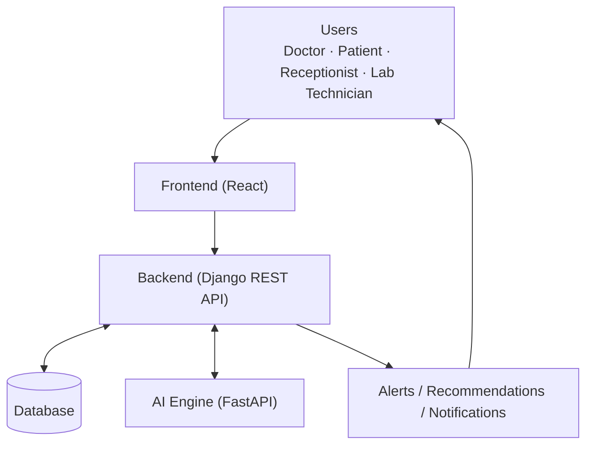
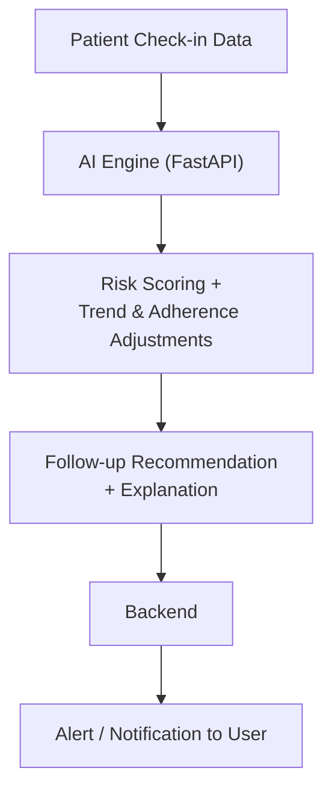

# HealBytes

A healthcare coordination platform that turns daily patient check-ins into risk-prioritized, role-based follow-up — using a deterministic AI Engine, not guesswork.

---

## What is HealBytes?

HealBytes keeps a patient's medications, daily check-ins, lab tests, and appointments in one system instead of scattered across paper, spreadsheets, and phone calls. It's built around four connected roles — **Doctor, Patient, Receptionist, and Lab Technician** — each with its own workflow and its own view of the data it actually needs.

The problem it addresses: routine follow-up is easy to miss. A small note in today's check-in ("I stopped taking the tablets," "the pain is worse than yesterday") can be an early warning sign, but no doctor has time to read every check-in personally. HealBytes solves this by scoring every check-in through a separate **AI Engine** — a deterministic, rule-based pipeline (not a chatbot or an opaque model) that combines current symptoms, a bounded look at recent trend, and medication adherence into a Low/Medium/High risk verdict, a recommended follow-up action, and a plain-language explanation. The backend uses that verdict to raise alerts and route notifications automatically, so doctors see the check-ins that matter most first.

---

## Key Features

**Patient & Healthcare Management**
- Patient registration and profiles, with caretaker contact details
- Invitation-code based patient onboarding
- Medication management with scheduled reminders
- Daily patient check-ins (symptoms, pain level, vitals, mood)
- Lab test requests, claiming, results, and doctor review
- Appointment booking, rescheduling, confirmation, and cancellation
- QR-code based, time-bounded doctor consult access

**AI-Powered Intelligence**
- Deterministic check-in risk assessment (Low / Medium / High) with a numeric score
- Bounded historical-trend and medication-adherence adjustments
- Deterministic follow-up action recommendations, with a plain-language explanation
- Patient history summarization (trends, active medications, latest labs, adherence)
- Document intelligence: OCR and entity extraction from uploaded medical documents
- Evidence-grounded clinical brief with source citations, assembled from records and documents
- Medication reconciliation and a unified, chronological patient timeline

**Communication & Workflow**
- Role-based workflows for Doctor, Patient, Receptionist, and Lab Technician
- In-app alerts and automatic email routing based on risk level
- Full email/notification audit log
- JWT-based authentication with role- and object-level permissions

---

## How HealBytes Works



- A user logs in through the React frontend with role-based access.
- The frontend calls the Django REST API, authenticated with a JWT token.
- The backend validates the request, applies role-based permissions, and reads/writes the database.
- For a check-in, the backend forwards the relevant data to the AI Engine for analysis.
- The AI Engine returns a risk level, score, and follow-up recommendation.
- The backend stores that result and, depending on risk level, raises alerts or sends notifications.
- The frontend reflects the updated state on the appropriate user's dashboard.

---

## AI Engine

The AI Engine is a separate FastAPI service, deliberately isolated from the Django backend and its database. It exists as its own service so the clinical scoring logic can be developed, tested, and eventually upgraded independently of the rest of the platform — it never queries a database directly; every fact it needs is included in the request the backend sends it.

It provides two capabilities today, both fully deterministic and rule-based — **no LLM, no external AI API, and no trained ML model is in the loop yet**:

- **Check-in risk assessment** (`POST /api/v1/analyze`) — scores a check-in from severity, duration, and symptom count, applies a bounded historical-trend adjustment and a bounded medication-adherence adjustment, then returns a risk level, follow-up action, and explanation.
- **Patient history summary** (`POST /api/v1/history/summary`) — given a patient's supplied check-in, medication, lab, and appointment history, returns trend indicators, active medications, the latest lab result, and computed medication adherence.

A related set of clinical-intelligence modules — document OCR, evidence retrieval, medication reconciliation, a patient timeline, and a grounding/safety check — runs inside the Django backend itself, not the AI Engine, since it needs direct database access. See [`ARCHITECTURE.md`](./ARCHITECTURE.md) for exactly how the two fit together and a full breakdown of every stage.



---

## Technology Stack

| Layer | Technology |
|---|---|
| Frontend | React 19, Vite, React Router, Tailwind CSS |
| Backend / API | Django 5, Django REST Framework, drf-spectacular (OpenAPI docs) |
| AI Engine | Python, FastAPI, Uvicorn, Pydantic v2 |
| Database | PostgreSQL (production), SQLite (local development) |
| Authentication | JWT via djangorestframework-simplejwt |
| Background Processing | Celery + Celery Beat, Redis broker |
| Document Intelligence | Tesseract OCR (pytesseract), scikit-learn + NumPy (semantic retrieval) |
| Testing | Django test framework (backend), pytest + httpx (AI Engine) |
| Containerization & Orchestration | Docker, Docker Compose (PostgreSQL 16, Redis 7, Backend, Celery Worker, Celery Beat) |
| Deployment | Gunicorn, Docker Compose, WhiteNoise |

---

## User Roles

| Role | Purpose |
|---|---|
| Doctor | Manages assigned patients, reviews check-ins and alerts, prescribes medications, requests lab tests, reviews the AI clinical brief |
| Patient | Submits daily check-ins, tracks medications and reminders, views lab results and appointments, generates a consult QR code |
| Receptionist | Registers patients on a doctor's behalf, generates invitation codes, manages appointments — no clinical data access |
| Lab Technician | Claims lab test requests and submits results — no access to a patient's broader record |

---

## Project Structure

```text
nhce-healthtech-healbytes/
├── src/                  # React + Vite frontend — pages, components, API client
├── backend/              # Django REST API — auth, patients, medications, check-ins, alerts, documents
│   └── Dockerfile        # Container image definition for Django API & Celery workers (Python 3.11 + Tesseract OCR)
├── ai-engine/            # FastAPI risk-assessment microservice (stateless, no database access)
├── database/             # Reference PostgreSQL schema (01-schema.sql) and notes
├── docker-compose.yml    # Multi-container orchestration (Postgres, Redis, backend, Celery worker & beat)
├── README.md             # You are here
└── ARCHITECTURE.md       # Full system and AI architecture reference
```

---

## Docker & Container Architecture

HealBytes uses **Docker** and **Docker Compose** to provide a reproducible, production-parity environment. The containerized stack encapsulates the database, cache, message broker, API server, and background asynchronous workers with automated healthchecks and dependency management.

```mermaid
flowchart TD
    subgraph Docker Network ["healbytes-network (Docker Compose)"]
        subgraph Data & Broker Layer
            DB[("PostgreSQL 16 Alpine<br/>healbytes_db :5432<br/>[Volume: postgres_data]")]
            REDIS[("Redis 7 Alpine<br/>healbytes_redis :6379<br/>[Volume: redis_data]")]
        end

        subgraph Application & Worker Layer
            BE["Django Backend API<br/>healbytes_backend :8000<br/>(Django REST Framework + Gunicorn)"]
            CW["Celery Worker<br/>healbytes_celery_worker<br/>(Async Alerts, Reminders, AI Hand-off)"]
            CB["Celery Beat<br/>healbytes_celery_beat<br/>(Periodic Medication Scheduler)"]
        end
    end

    FE["Frontend (Vite / React Dev Server)<br/>http://localhost:5173"] -->|REST API Calls| BE
    AI["AI Engine (FastAPI)<br/>http://localhost:8001"] <-->|Risk Assessment| BE

    BE -->|Healthchecked Dependency| DB
    BE -->|Cache & Celery Broker| REDIS
    CW -->|Task Processing| REDIS
    CW -->|State & Persistence| DB
    CB -->|Schedule Dispatch (1/min)| REDIS
```

### Containerized Services Breakdown

| Service | Container Name | Base Image | Port | Purpose & Configuration |
|---|---|---|---|---|
| **`db`** | `healbytes_db` | `postgres:16-alpine` | `5432` | Relational database. Auto-initializes schema from `database/schema.sql`. Uses `postgres_data` persistent volume and `pg_isready` healthcheck. |
| **`redis`** | `healbytes_redis` | `redis:7-alpine` | `6379` | In-memory cache and Celery message broker. Uses `redis_data` volume and `redis-cli ping` healthcheck. |
| **`backend`** | `healbytes_backend` | Custom `backend/Dockerfile` (`python:3.11-slim`) | `8000` | Django 5 REST Framework API. Bundles Tesseract OCR (`tesseract-ocr`) and PostgreSQL headers (`libpq-dev`). Automatically runs `manage.py migrate` on startup. |
| **`celery_worker`** | `healbytes_celery_worker` | Custom `backend/Dockerfile` | — | Asynchronous worker processing background jobs: email dispatches, risk alert routing, and medication reminder notifications. |
| **`celery_beat`** | `healbytes_celery_beat` | Custom `backend/Dockerfile` | — | Periodic scheduler that runs every minute to evaluate and trigger active medication reminders across patients. |

### Docker Healthcheck & Dependency Graph
- The `backend`, `celery_worker`, and `celery_beat` services define `depends_on` conditions with `condition: service_healthy` for both `db` and `redis`.
- Containers will only start processing once PostgreSQL is ready to accept connections and Redis responds to `PING`, preventing race conditions during startup.

---

## Getting Started

You can run HealBytes either using **Docker Compose** (recommended for a full, production-like backend, database, and Celery stack) or via **Manual Local Setup** (ideal for rapid lightweight code editing).

### Prerequisites
- **Docker** & **Docker Compose v2+** (for containerized setup)
- **Python 3.10+** (for manual local backend & AI Engine setup)
- **Node.js 18+ & npm** (for frontend)

### Clone Repository
```bash
git clone https://github.com/nimrafshaikh-sketch/nhce-healthtech-healbytes.git
cd nhce-healthtech-healbytes
```

---

### Option A: Running with Docker (Recommended)

Run the full backend infrastructure (Postgres 16, Redis 7, Django REST API, Celery Worker, and Celery Beat) in isolated containers with a single command:

#### 1. Configure Environment Variables
```bash
# Copy root environment variables
cp .env.example .env

# Optional: configure backend and AI engine envs if running them individually
cp backend/.env.example backend/.env
cp ai-engine/.env.example ai-engine/.env
```

#### 2. Build and Start Docker Containers
```bash
docker compose up --build -d
```

Check running container status:
```bash
docker compose ps
```

#### 3. Create a Django Superuser / Admin
```bash
docker compose exec backend python manage.py createsuperuser
```

#### 4. Start AI Engine & Frontend (Locally)
While the backend stack runs in Docker:
```bash
# In terminal 1 (AI Engine):
cd ai-engine
python3 -m venv .venv && source .venv/bin/activate
pip install -r requirements-dev.txt
uvicorn app.main:app --reload --port 8001

# In terminal 2 (Frontend):
npm install
npm run dev:frontend
```

#### 5. Useful Docker Commands

| Action | Command |
|---|---|
| View real-time logs across all containers | `docker compose logs -f` |
| View backend or celery logs | `docker compose logs -f backend celery_worker` |
| Run Django database migrations | `docker compose exec backend python manage.py migrate` |
| Open an interactive Django shell | `docker compose exec backend python manage.py shell` |
| Access PostgreSQL CLI inside container | `docker compose exec db psql -U healbytes -d healbytes` |
| Restart all containers | `docker compose restart` |
| Stop all containers | `docker compose down` |
| Stop containers and reset database/volumes | `docker compose down -v` |

---

### Option B: Manual Local Setup (Without Docker)

If you prefer running services directly on your host system with SQLite:

#### Backend Setup (Local)
```bash
cd backend
python3 -m venv venv
source venv/bin/activate
pip install -r requirements.txt
cp .env.example .env
python manage.py migrate
python manage.py createsuperuser
python manage.py runserver
```
API available at `http://localhost:8000/api/`.

#### AI Engine Setup (Local)
```bash
cd ai-engine
python3 -m venv .venv
source .venv/bin/activate
pip install -r requirements-dev.txt
uvicorn app.main:app --reload --port 8001
```
Interactive docs at `http://localhost:8001/docs`.

#### Frontend Setup (Local)
```bash
npm install
cp .env.example .env
npm run dev:frontend
```
Serves at the Vite dev URL (default `http://localhost:5173`).

#### Running Everything Together (Concurrent Dev Mode)
Once `backend/venv` and `ai-engine/.venv` exist, launch all three locally:
```bash
npm run dev
```

---

### Environment Variables Reference
Three `.env.example` files define the configuration parameters:
- **Root `.env.example`** — PostgreSQL credentials, Redis broker URL, backend secret key, AI Engine URL, and email backend settings used by Docker Compose.
- **`backend/.env.example`** — Django secret key, database credentials, Redis URL, AI Engine endpoint, token expiry durations, and SMTP settings.
- **`ai-engine/.env.example`** — Model version tags and log level (AI Engine is stateless and requires no database).

---

## API / Documentation

- **Backend Swagger UI**: `http://localhost:8000/api/docs/`
- **Backend ReDoc**: `http://localhost:8000/api/redoc/`
- **Backend OpenAPI Schema**: `http://localhost:8000/api/schema/`
- **AI Engine Interactive API Docs**: `http://localhost:8001/docs`
- **Architecture & AI Pipeline Reference**: [`ARCHITECTURE.md`](./ARCHITECTURE.md)

---

## Testing

**Backend**
```bash
cd backend
DJANGO_SETTINGS_MODULE=config.settings.test python manage.py test apps
```
Covers authentication, invitations, patients, medications, check-ins and AI hand-off parsing, alert routing, QR access, appointments, lab tests, and the document intelligence / clinical-brief pipeline.

**AI Engine**
```bash
cd ai-engine
pip install -r requirements-dev.txt
pytest
```
Covers request/response schema validation, the risk engine, trend detection, medication adherence, follow-up recommendations, explanations, and the history-summary endpoint.

No automated test suite is configured for the frontend yet.

---

## High-Level System Flow

1. A patient submits a daily check-in from the frontend.
2. The backend authenticates the request and saves the check-in.
3. The backend sends the check-in, medical context, and recent history to the AI Engine.
4. The AI Engine returns a risk level, score, follow-up action, and explanation.
5. The backend stores the result on the check-in record.
6. Based on the risk level, the backend raises an in-app alert and/or routes emails to the doctor, caretaker, and patient.
7. The doctor sees the check-in and alert on their dashboard, prioritized by risk.

---

## Why HealBytes?

- Centralizes patient information, medications, check-ins, lab tests, and appointments behind one role-based system instead of scattered tools.
- Adds automated, explainable risk scoring to daily check-ins so care teams can prioritize follow-up instead of reviewing every entry manually.
- Keeps the AI logic deterministic and auditable — every score traces back to a specific, inspectable rule, not a black box.
- Separates the AI Engine from the backend so either can evolve independently, including a future move to a trained model.
- Supports the distinct workflows of doctors, patients, receptionists, and lab technicians, with permissions scoped to each role.

---

## Documentation

- [`ARCHITECTURE.md`](./ARCHITECTURE.md) — full system architecture, the AI Engine's pipeline, and the backend's clinical-intelligence pipeline in detail
- [`HealBytes_MultiAgent_Architecture_Plan.md`](./HealBytes_MultiAgent_Architecture_Plan.md) — audit and design plan behind the clinical-intelligence pipeline
- [`HealBytes_Phase2_MultiAgent_Implementation_Report.md`](./HealBytes_Phase2_MultiAgent_Implementation_Report.md) — implementation report for that pipeline
- [`HealBytes_Independent_Verification_Report.md`](./HealBytes_Independent_Verification_Report.md) — independent security and functionality audit
- [`database/README.md`](./database/README.md) — reference database schema notes
- [`backend/README.md`](./backend/README.md) and [`ai-engine/README.md`](./ai-engine/README.md) — service-specific setup and implementation notes

