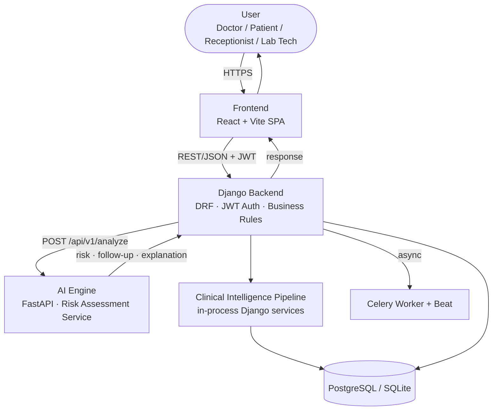

# HealBytes Backend

Django + DRF backend covering: Doctor/Patient/Receptionist/Lab Tech auth,
patient registration, invitation codes, medications & reminders, daily
check-ins, alerts, QR verification, appointments, lab tests, and
notifications, for the AI-Based Autonomous Healthcare Coordination and
Follow-up Agent.

This directory is self-contained and does not modify anything outside
`backend/` (frontend, AI engine, or shared infra are owned by other
team members).

---

## 🏗️ System Architecture


HealBytes is a two-service system: a React SPA talking to a modular Django/DRF backend that owns every clinical record, and a **standalone, stateless FastAPI microservice** that turns a single check-in into a deterministic risk verdict. No LLM, no external AI API, and no vector database sit in the critical path today — every "AI" decision in this repo is a rule-based, fully explainable pipeline you can trace line-by-line, on purpose.

**Why it's built this way:**

- **The AI Engine never touches the database.** It receives a JSON snapshot from the backend, computes, and returns JSON — nothing more. Swap the scoring logic for a trained model later without touching Django, the DB, or the frontend.
- **Two AI pipelines, not one blurry "AI layer."** A real-time **Risk Assessment Service** (check-in → score) and an on-demand, in-process **Clinical Intelligence Pipeline** (documents → evidence-grounded doctor brief) are kept structurally separate because they solve different problems.
- **Every score is bounded and explainable.** Secondary signals (history trend, medication adherence) can only ever *nudge* a score by a few points — never flip a verdict on their own — and every generated brief is re-verified against the live database before it's considered final.
- **Nothing is over-claimed.** No HIPAA/GDPR/SOC 2 claims, no "AI-generated" labels on deterministic templates, no microservice sprawl for its own sake.

### The system, end to end



### Layers at a glance

| Layer | What lives there | Status |
|---|---|---|
| Presentation | React + Vite SPA, role-based views | Implemented |
| API | DRF views/serializers, JWT auth, RBAC | Implemented |
| AI Engine | FastAPI, stateless, no DB access | Implemented |
| Clinical Intelligence | Document intelligence, RAG, medication reconciliation, timeline, grounding — all in-process in Django | Implemented |
| Async | Celery + Celery Beat for reminders & alert emails | Implemented |
| Data | PostgreSQL (prod) / SQLite (dev) via Django ORM | Implemented |
| Infra | Docker Compose (DB, Redis, backend, workers) | Partial — AI Engine & frontend not yet containerized |

### Two pipelines, six agents each

**Check-in Risk Assessment** *(AI Engine, per request)*:
`Risk Baseline` → `Trend Detector` → `Medication Adherence` → `Risk Assessor (combine + clamp)` → `Follow-up Recommender` → `Explanation Service`

**Clinical Brief** *(Django backend, on demand)*:
`Document Intelligence (OCR)` → `Clinical Retrieval (RAG, semantic + keyword fallback)` → `Medication Intelligence` → `Patient Timeline` → `Clinical Brief Synthesizer` → `Grounding Verifier`

Each stage is a plain, single-purpose function called in a fixed order by its orchestrator — not autonomous agents messaging each other. That's deliberate: every stage is independently testable, replaceable, and fails safe (an unreachable AI Engine degrades to `"unavailable"` rather than blocking a check-in; semantic retrieval automatically falls back to keyword search; every citation in a brief is re-verified against the database before being shown to a doctor).

**📄 Full architecture reference:** [`ARCHITECTURE.md`](./ARCHITECTURE.md) — component-by-component responsibilities, the full 12-agent table with inputs/outputs/failure modes, end-to-end data flow, API boundaries, data architecture, security model, AI safety guarantees, scalability, observability, and the extensibility roadmap.

---

## Stack

Python 3.10+, Django 5, DRF, SimpleJWT, Celery + Celery Beat (django-celery-beat,
database-backed schedule), Redis (broker + cache), drf-spectacular, Gunicorn,
SQLite (dev) / PostgreSQL (prod).

## Project layout

```
backend/
  config/
    settings/{base,dev,prod,test}.py
    urls.py, celery.py, wsgi.py, asgi.py
  apps/
    core/            shared base models, permissions, exception handler
    accounts/         Doctor/Patient/Receptionist/Lab Tech auth (custom User, JWT)
    patients/         Patient profile + caretaker details, receptionist admin
                       serializer/search, analytics
    invitations/      Invitation code generate/redeem (Doctor or Receptionist)
    medications/       Medication + reminder scheduling (Celery Beat)
    checkins/           Daily check-ins + AI-engine stub integration
    alerts/            Alert model + routing rules
    qr/                 QR token generate/verify (assigned Doctor only)
    notifications/     In-app notification records + email audit log
    appointments/      Appointment booking/reschedule/confirm/cancel
    labtests/           LabTestRequest + LabTestResult, claim/result/review flow
  manage.py, requirements.txt, Dockerfile, .env.example
```

## Setup (local dev, SQLite)

```bash
cd backend
python3 -m venv venv && source venv/bin/activate
pip install -r requirements.txt
cp .env.example .env   # adjust as needed
python manage.py migrate
python manage.py createsuperuser
python manage.py runserver
```

API docs: `/api/docs/` (Swagger UI), `/api/redoc/`, raw schema at `/api/schema/`.

## Running Celery (reminders, AI hand-off, alert routing)

Requires Redis running locally (`redis-server`, or via the shared docker-compose
once the infra teammate provides it).

```bash
celery -A config worker -l info
celery -A config beat -l info   # dispatches medication reminders every minute
```

## Tests

```bash
DJANGO_SETTINGS_MODULE=config.settings.test python manage.py test apps
```

101 tests covering auth, invitation generation/redemption (incl. 15-min
expiry, and Receptionist-on-behalf-of-doctor reuse), patient scoping/permissions
(incl. Receptionist create/search), medication CRUD + reminder dispatch
(+ patient email), AI client response parsing (valid/invalid/timeout), check-in
submission + full notification fan-out per the table above, alert
acknowledge/resolve, QR generate/verify (incl. 15-min expiry, wrong-doctor
rejection, and logging on every outcome including invalid tokens), the email
audit-log endpoints, appointment booking/reschedule/confirm/cancel across all
four roles, and the full lab test request/claim/result/review flow.

## Business-rule defaults (flagged for review)

- **Invitation codes** (`apps/invitations/models.py`): 8-char alphanumeric,
  single-use, expire after `INVITATION_CODE_EXPIRY_MINUTES` (default **15 min**).
- **QR tokens** (`apps/qr/tokens.py`): signed JWT (HS256, `SECRET_KEY`),
  identifies one patient, expires after `QR_TOKEN_EXPIRY_MINUTES` (default **15 min**).
  Verified server-side on scan; only the assigned doctor may redeem it.
- **AI engine contract** (`apps/checkins/ai_client.py`): `POST {AI_ENGINE_URL}/analyze/`
  → `{"riskLevel": "low"|"medium"|"high", "riskScore": 0.0-1.0, "reason": str,
  "recommendedAction": str, "notificationRecipient": str}`. Stored on
  `DailyCheckin` as `ai_risk_level`, `ai_risk_score`, `ai_notes` (= reason),
  `ai_recommended_action`, `ai_notification_recipient`. If `AI_ENGINE_URL` is
  unset, the call fails/times out, or the response is malformed, the check-in
  still saves with `ai_risk_level="unavailable"` and no alert/email fires.
  **`notificationRecipient` is informational/logged only** - the backend
  always decides actual routing itself via risk level (see below), so the
  two systems can never disagree about who gets notified.
- **Alert routing & notifications** (`apps/alerts/rules.py`) - the in-app
  Alert, the doctor email, the caretaker email, and the patient's own-result
  email are four independent mechanisms, each gated by its own rule function,
  because their trigger conditions don't line up 1:1:

  | AI risk  | In-app Alert (doctor dashboard) | Doctor email | Caretaker email | Patient result email |
  |----------|----------------------------------|---------------|-------------------|------------------------|
  | high     | yes (doctor + caretaker)         | **yes**       | no                | yes |
  | medium   | yes (doctor)                     | no            | **yes**           | yes |
  | low      | no                               | no            | **yes**           | yes |
  | unavailable/pending | no                    | no            | no                | no |

  Doctor email is deliberately HIGH-only so the doctor isn't inundated with
  email for every moderate check-in - medium still shows up on their
  dashboard via `/api/alerts/`. Caretaker email is deliberately LOW/MEDIUM
  only - high-risk stays an urgent doctor-facing case instead. The patient
  always gets emailed their own result (reason + recommended action) except
  when the AI engine didn't return a verdict.
- **Caretaker**: no login/dashboard of their own (not in scope) - just
  `caretaker_name` + `caretaker_email` fields captured when the doctor adds
  a patient.
- **Email audit trail**: every outbound email (doctor, patient, or
  caretaker; alert, check-in result, or medication reminder), sent or
  failed, is logged in `EmailNotificationLog` -
  `/api/notifications/email-logs/` (doctor, scoped to their patients) and
  `/api/notifications/email-logs/me/` (patient, their own only).
- **Email backend**: `django.core.mail.backends.console.EmailBackend` by
  default (dev/hackathon) - emails are fully composed and printed to the
  server console/log, not actually delivered. Switch to real SMTP by setting
  `EMAIL_BACKEND=django.core.mail.backends.smtp.EmailBackend` plus
  `EMAIL_HOST`/`EMAIL_PORT`/`EMAIL_HOST_USER`/`EMAIL_HOST_PASSWORD`/`EMAIL_USE_TLS`
  in `.env` - no code changes needed. All sends go through Celery
  (`apps/notifications/tasks.py`), never inline in the request/response cycle.

## API areas

`/api/auth/`, `/api/patients/`, `/api/invitations/`, `/api/medications/`,
`/api/checkins/`, `/api/alerts/`, `/api/qr/`, `/api/notifications/`,
`/api/analytics/`, `/api/appointments/`, `/api/labtests/` — full detail in `/api/docs/`.


## Roles: Receptionist & Lab Technician (added on top of Doctor/Patient)

Both are internal clinic staff roles with **no public registration
endpoint** - accounts are created via Django admin only (approved scope for
this build; revisit if a self-service or admin-created-by-doctor flow is
needed later).

- **Receptionist** is a purely administrative actor - **no access to
  clinical information anywhere** (no `medical_notes`, no QR/history access,
  no lab data). Can: search patients (`GET /api/patients/search/` - requires
  `phone_number`, or both `name` and `date_of_birth`; never an unfiltered
  list, to avoid enumerating the roster), create a patient on behalf of a
  chosen doctor (`POST /api/patients/` with an explicit `doctor` field),
  generate an invitation code for a patient they created (`POST
  /api/invitations/generate/` with `patient_id` - the invitation's `doctor`
  is taken from the patient's assignment, not the receptionist), and book/
  reschedule/update any appointment for any doctor/patient.
- **Lab Technician** only ever sees lab work assigned to them or sitting in
  the unclaimed queue - never a patient's full record, never QR/history,
  never appointments. Claims a request (`POST
  /api/labtests/requests/<id>/claim/`), then submits its result (`POST
  /api/labtests/requests/<id>/result/`).

**QR verification stays exactly as originally scoped**: only the patient's
*assigned* Doctor may verify a QR code - this was deliberately NOT opened up
to Receptionist or Lab Tech, since QR access is clinical-history access and
neither role has clinical-data permissions in the locked role matrix. The
only QR change in this pass was a bug fix: every verification attempt is now
logged via `QRScanLog` regardless of outcome (invalid/expired/malformed
token, patient not found, wrong doctor, or success) - previously the first
two cases logged nothing at all.

## Appointment

`apps/appointments/models.py` - `patient`, `doctor` (required), `created_by`,
`scheduled_at`, `duration_minutes` (default 30), `reason`, `status`
(scheduled/confirmed/completed/cancelled/no_show), `notes`.

- Receptionist: full create/reschedule/status-update, any patient/doctor.
- Doctor: create/reschedule for their own patients only, with themselves as
  the doctor (`POST /api/appointments/`, `PATCH /api/appointments/<id>/`).
- Patient: read-only on their own appointments, plus two narrow transitions -
  `POST /api/appointments/<id>/confirm/` (scheduled → confirmed) and `POST
  /api/appointments/<id>/cancel/` (scheduled/confirmed → cancelled). No
  general write access.

## Lab Tests

`apps/labtests/models.py` - `LabTestRequest` (`patient`, `requested_by`,
`test_name` - a fixed 8-value choice field: CBC, BLOOD_GLUCOSE,
LIPID_PROFILE, HBA1C, KFT, LFT, TFT, URINALYSIS, chosen so the AI engine's
reference-range lookup has a stable key to match against - **confirm with
Member 4 that these match their table**; `assigned_lab_tech`, `priority`,
`status` - requested/in_progress/completed/cancelled) and `LabTestResult`
(one-to-one with the request; `result_text` only, no file upload since
there's no file storage configured in this build).

Flow: Doctor requests (`POST /api/labtests/requests/`) → sits in the
unclaimed queue → a Lab Tech claims it (`POST .../claim/`, sets
`assigned_lab_tech` + moves to `in_progress`) → that same tech submits the
result (`POST .../result/`, moves to `completed`) → the requesting doctor
reviews it (`POST /api/labtests/results/<id>/review/`). Doctor can cancel
a still-open request (`POST .../cancel/`). **Receptionist has zero access
to this app anywhere** - matches the locked role matrix (flat No on lab
order/result), not just result content.
